# MarketNeural: Learning Time in Moving Markets

Technical edition 0.2 / 21 September 2026.

# The research problem and the system that made it measurable

## A decision under a moving information boundary

A listing is a temporary offer whose description, price, photographs and availability may change before an analyst finishes examining it. A useful intelligence system must do more than recognize an attractive item. It must identify what is known now, estimate how long the opportunity may remain available, and preserve enough evidence to explain the decision later. This project built an operational data platform around that problem and developed survival models over its structured and multimodal representations.

The subject of this monograph is the implemented system and the evidence it produced. That includes scheduled workflows, stored content, enrichment services, temporal feature stores, trained neural configurations, a three-stage survival cascade, a later independent multimodal model, candidate queues, explanatory narratives, and an operator-controlled conversation agent. These components formed a research environment: they made observations repeatable, provided outcome follow-up, and exposed failure modes that could not have been discovered from a static benchmark alone.

The system's scale is substantial for an applied research platform. A retained database snapshot contains 55,260 listing rows, 240,622 image assets and 228,958 image-feature records within 29.1 GB. The operator reports approximately 70,000 successful workflow runs over the platform's lifetime. The inspected scheduler snapshot retains 15,360 runs over 40 workflow identifiers, including 15,254 stored successes. These are different evidence scopes. The smaller retained history establishes a documented operational footprint; it neither verifies nor contradicts the wider lifetime total.

The central statistical difficulty is that a training row is not automatically a historical decision. An attractive feature may exist in a present-day table only because an item remained observable long enough for a later job to process it. A report written after the outcome can improve a retrospective prediction while being unavailable when the actual decision was made. A model can exploit that distinction through missingness without ever reading an explicit outcome column. The platform's most instructive leakage investigation concerns precisely this failure.

## What the work contributes

The engineering contribution is the connection among content processing, temporal contracts, model evaluation and operational evidence. The implementation does not invent all of its mathematical ingredients. Survival likelihoods, proportional hazards, boosted trees, pretrained embeddings, attention, mixture distributions and exponential recency weighting have established precedents. The contribution under examination is how those ingredients were assembled and constrained in a fast-changing market, and what the resulting evidence says about their usefulness and limitations.

The methodological contribution is a concrete account of information boundaries. It distinguishes event time, first observation, content availability, feature computation and decision time. It examines how those clocks interact with feature-store refreshes, train-only transformations, label maturity and model selection. It also documents why declared temporal checks can fail when the observation process itself depends on the outcome.

The modeling contribution includes recoverable historical numerical algorithms and portable implementations for the three-stage cascade. The later selected multimodal model contains 17,145,736 unique parameters and combines structured attributes, listing text, image vectors and image-report vectors. Its complexity is technically meaningful, but parameter count is not evidence of superiority. The controlled comparison must determine whether useful gains arise from richer information, nonlinear representations, better handling of censoring, a different decision policy, or merely a larger tuning budget.

The operational contribution includes a real operator system for candidate review, explanation, message drafting, approval and conversation-state reconciliation. The narrative layer and the large-language-model service are separate from the survival network. They use its outputs and other evidence to support decisions; they do not convert an uncertain forecast into an independently verified fact. Their implementation is described later alongside the parts of autonomous operation that remain a prospective research extension.

## Questions that the evidence can answer

This monograph asks five connected questions. First, what data and engineering were necessary to construct prediction-time representations at the observed scale? Second, how did the implemented cascade and later multimodal network formulate their survival targets and decision rules? Third, which safeguards detected leakage, and which mechanisms escaped them? Fourth, how much do the retained results establish about predictive behavior, adaptation and operational reliability? Fifth, how can the implemented decision architecture use survival information while preserving the distinction between analysis, policy and execution?

The available evidence answers these questions unevenly. Source code and saved configurations establish many architectural details. Prediction artifacts support exact recomputation of selected confusion matrices and overlap counts. Retained reports document tests and operational behavior at particular dates. Some claims, including lifetime workflow volume, depend on the operator's report. Other claims, including a matched real-data demonstration that neural networks outperform Cox or tree models, remain untested in the released evidence.

This asymmetry is part of the research result. A thesis-style treatment should preserve it rather than flatten all statements into a single confidence level. Successful scheduling is evidence of execution. A restoration report is evidence of recoverability within its declared checks. A parity test is evidence of agreement between implementations. None of these alone establishes calibration, prospective utility or economic return.

## Reading the empirical record

Historical cohorts are kept separate. An earlier sold-only Slow21 tree-model evaluation does not share the target population of a later FAST72 neural policy. The more recent slice of the locked policy is nested inside its holdout and cannot serve as a second independent test. A later rebuilt training table supplies evidence of overlap in that reconstruction, but cannot be silently substituted for a missing original fit matrix. Each distinction changes which comparisons are valid.

The public synthetic benchmark is a reproducibility exercise. It checks that temporal splitting, censoring, preprocessing, model fitting, selection and reporting can run coherently. Its results are reported even where a conventional baseline performs best. They do not measure effectiveness in the original market. A future real-data comparison must preserve the same discipline and permit a negative result for the proposed neural architecture.

The remainder of the monograph develops the statistical foundations, the actual data and enrichment mechanisms, the released model and SQL implementations, the leakage case study, the retained empirical record, and the operational decision architecture. It ends with a reproduction contract and a research agenda whose success criteria are observable rather than promotional.


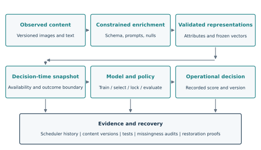

# Statistical foundations for decisions in a changing market

## The observation is a decision, not merely a listing

A time-to-event dataset is often presented as a matrix of attributes, a duration, and an event indicator. In a changing marketplace, that representation is the end of a construction process rather than its starting point. A listing may be edited, enriched, observed repeatedly, temporarily unavailable, or offered again. The question asked of the model depends on when a decision becomes possible and on which version of those attributes is visible. Two records describing the same physical object at different times need not represent the same prediction problem.

The primary observation in this research is an eligible listing episode at a declared decision time $t_0$. Eligibility means that the item remains at risk of the event and that the specified information is available. Let $X(t_0)$ denote that information, $T$ the future duration to the event, and $C$ the remaining observation duration. The observed pair is

$$
Y=\min(T,C), \qquad \delta=\mathbf{1}\{T\le C\}.
$$

The survival function $S(t\mid X)=P(T>t\mid X)$ is the probability of remaining event-free beyond duration $t$. It supports several decisions without requiring separate definitions of elapsed time. A short-horizon event score is $1-S(72\mid X)$; a twenty-one-day persistence score is $S(504\mid X)$. These quantities describe a declared event, such as a reported sold transition. They are not automatically probabilities of an independently verified transaction, profitable purchase, or satisfactory item condition.

The same discipline applies to denominators. The retained operational snapshot contains 55,260 listing rows and 240,622 image assets. These establish a substantial data-processing scale, but they are not 295,882 independent survival observations. Several assets can belong to one listing, representations can be versioned, and many listings may lack mature outcomes at a particular cutoff. Statistical sample size is determined by the evaluated entities and their observed outcomes, not by the sum of database row counts.

## Censoring and the meaning of an unresolved outcome

Right censoring means that an event has not been observed before follow-up ends. A record followed for twelve hours cannot be labeled a negative for an event within seventy-two hours. It contributes evidence that the event time exceeds twelve hours. The survival likelihood preserves this information instead of either inventing a negative or discarding the record entirely.

For an exact event time with density $f$ and a right-censored observation, the usual contribution is

$$
L_i=f(Y_i\mid X_i)^{\delta_i}S(Y_i\mid X_i)^{1-\delta_i}.
$$

This factorization relies on the observation mechanism being ignorable under the assumed censoring model. If unavailable records are systematically those most likely to experience the event, a purely administrative interpretation is inadequate. Collection gaps, withdrawals, and observation policies can create censoring associated with attributes or outcomes. The research protocol therefore records the reason follow-up ended where possible and treats independent censoring as an assumption to investigate.

Periodic observations also create interval uncertainty. If a listing is live at one observation and marked sold at the next, an event interval $(L_i,U_i]$ may be more defensible than an exact timestamp. Its contribution is $S(L_i\mid X_i)-S(U_i\mid X_i)$. Right censoring is recovered by taking $U_i=\infty$. A source-provided timestamp can narrow the interval only to the extent that its semantics are understood. A modification timestamp is not transaction ground truth merely because it is precise to the second.

Historical zero-duration outcomes illustrate this issue. Equal origin and endpoint metadata can arise from coarse resolution, observation delay, or a source convention. Some such cases may already have completed before the system could score them. The appropriate response is to inspect provenance and define an admissible decision cohort. Removing every zero after seeing its effect on accuracy changes the population and cannot by itself establish a corrected benchmark.

## Proportional hazards and accelerated failure time

Cox regression provides a useful reference because its structure is explicit:

$$
\lambda(t\mid X)=\lambda_0(t)\exp(\beta^\top X), \qquad
S(t\mid X)=S_0(t)^{\exp(\beta^\top X)}.
$$

Covariates multiply a shared baseline hazard. Penalization can stabilize estimates when structured variables and fixed embeddings are numerous relative to events. The limitation is not that the model is “simple” in an informal sense, but that relative hazards remain constant over time under the model. Nonlinear transformations or a neural risk function can make covariate effects more flexible without removing that proportional-hazards structure. [Cox, 1972](https://rss.onlinelibrary.wiley.com/doi/10.1111/j.2517-6161.1972.tb00899.x); [Katzman et al., 2018](https://bmcmedresmethodol.biomedcentral.com/articles/10.1186/s12874-018-0482-1).

The earlier project instead emphasized accelerated failure-time modeling. In its location-scale form,

$$
\log T=f_\theta(X)+\sigma\varepsilon,
\qquad
S(t\mid X)=1-F_\varepsilon\!\left(\frac{\log t-f_\theta(X)}{\sigma}\right).
$$

The learned function shifts log duration, while the error distribution and scale determine the shape of the conditional distribution. Tree boosting makes $f_\theta$ nonlinear and allows interactions among price context, item attributes, and generated condition features. Its censoring-aware objective remains a survival objective; thresholding a point prediction at twenty-one days is a subsequent decision rule.

The error-family figure below is methodological, not a fit to an observed duration histogram. Different tail shapes can materially change $S(504)$ even where central predictions are similar. Choosing a distribution therefore deserves development-set comparison and tail calibration checks, rather than selection by visual plausibility alone.

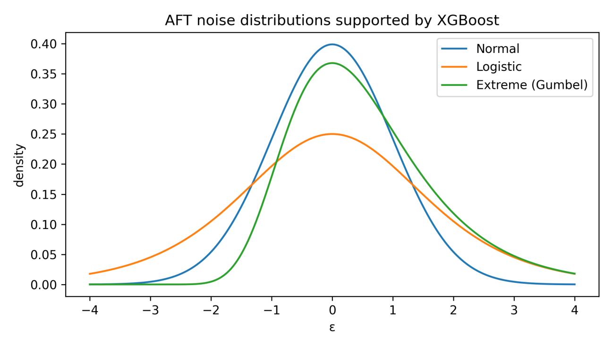

Historical figure H01. Standardized distributions from the earlier tail-model chapter, PDF page 4. The curves illustrate assumptions; they are not empirical evidence for one distribution.

## Flexible survival functions and discrete hazards

Random survival forests model nonlinear structure through ensembles of survival trees and provide a strong alternative to neural methods. A discrete-hazard neural network parameterizes conditional event probabilities over time intervals. These are different ways of controlling flexibility; neither is intrinsically superior across datasets. [Ishwaran et al., 2008](https://ishwaran.org/papers/IKBL.AOAS.pdf); [Gensheimer and Narasimhan, 2019](https://peerj.com/articles/6257/).

For boundaries $0=b_0<\cdots<b_K$, define

$$
h_k(X)=P(b_{k-1}<T\le b_k\mid T>b_{k-1},X),
\qquad S(b_k\mid X)=\prod_{j=1}^{k}(1-h_j(X)).
$$

The product enforces survival monotonicity. It does not enforce calibration, correct endpoint construction, or temporal admissibility of $X$. The compact public implementation interpolates log survival within each bin. A seventy-two-hour query can therefore lie inside a bin: the 120-hour, 24-bin demonstration evaluates it between 70 and 75 hours. The preserved 504-hour, 128-bin architecture places it between 70.875 and 74.8125 hours. Reporting the horizon precisely requires the interpolation convention as well as the number of bins.

A survival curve and a dedicated binary head may disagree because they optimize different objectives. The historical cascade contains auxiliary classification scores as well as survival outputs. A historical policy combining classification heads cannot be evaluated as if it were simply $1-S(72)$. This distinction becomes especially important when discussing calibration or comparing the new compact implementation with earlier saved policy results.

## Sparse segments and hierarchical price anchors

A market can be large overall and sparse within the segment relevant to an individual decision. Conditioning jointly on product family, capacity, condition, locality, and recent date can leave few comparable observations. A raw segment mean may then be unstable, while a fully pooled market average may ignore economically important distinctions. The historical anchor system addresses this by expressing asking price relative to a supported reference and recording how much pooling was required.

For a normal-normal explanatory model with within-group variance $\sigma^2$ and prior variance $\tau^2$, the posterior mean has weight

$$
\widetilde\mu_g=w_g\bar y_g+(1-w_g)\mu_{p(g)},
\qquad w_g=\frac{n_g}{n_g+\sigma^2/\tau^2}.
$$

This equation explains why low-support groups borrow information. The implemented historical method uses robust medians or quantiles and a discrete support-based backoff hierarchy. It is inspired by hierarchical shrinkage but is not equivalent to fitting that conjugate model. Likewise, choosing the first sufficiently supported level is an algorithmic rule, not a posterior probability calculation unless an explicit probabilistic model supplies that interpretation.

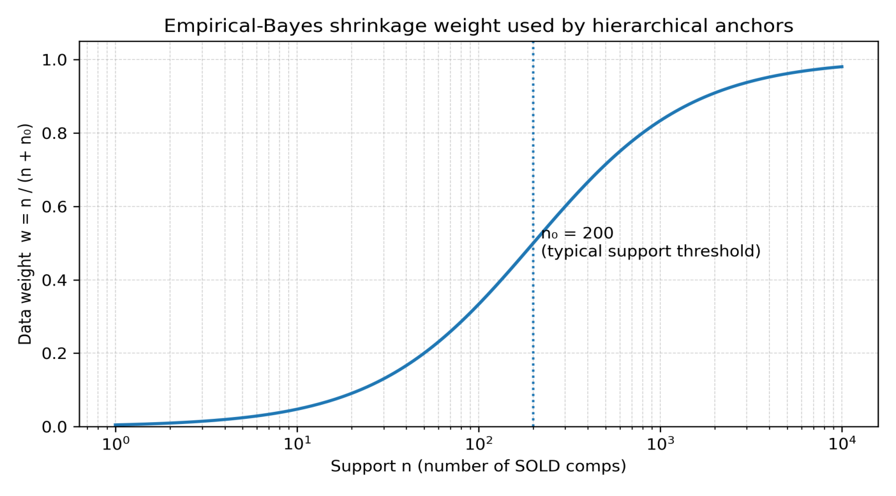

Historical figure H02. Illustrative shrinkage weight from the anchor chapter, PDF page 3. The support threshold shown is an explanatory setting, not an independently optimized universal constant.

A price-relative feature can be written $r_i=\log(p_i/a_i)$, where $p_i$ is the ask and $a_i$ an admissible historical anchor. Support counts, age of contributing observations, and the chosen fallback level accompany $r_i$. Without these reliability features, two identical ratios could conceal very different evidence bases. Outcome-derived anchors must also exclude the target record and any comparison whose outcome was unavailable at the decision.

## Time from the present and adaptation to change

A listing still live at age $a$ has supplied additional survival information. Under a model fitted at the initial origin, its residual event probability is

$$
P(T\le a+h\mid T>a,X_0)=1-\frac{S(a+h\mid X_0)}{S(a\mid X_0)}.
$$

The expression requires $S(a\mid X_0)>0$ and generally differs from $1-S(h\mid X_0)$. It also does not justify replacing initial covariates with later values in an initial-snapshot model. A landmark model trained at the actual later decision, or an appropriately specified time-varying model, can incorporate substantial new information. Fast-moving markets make this a practical requirement: a prediction delivered too late may describe an outcome window already partly or wholly elapsed.

Observed short-horizon prevalence changed from 56.34% in one historical selection cohort to 63.10% in the broader holdout and 77.74% in its recent nested slice. Those are selected-cohort rates, not estimates of market-wide turnover. They nevertheless demonstrate why calibration and policy evaluation must state their population. Refreshing features, retraining a model, recalibrating probabilities, and moving a threshold are different adaptations with different validation requirements.

Finally, observational duration models do not identify the effect of changing the asking price. Price, quality, urgency, and seller behavior may share unobserved causes. The research can establish prediction quality for a defined population before it can establish a beneficial intervention. This separation keeps statistical evidence useful without inflating it into a causal or economic claim.

# The temporal platform as part of the research method

## Why the feature pipeline determines the experiment

The temporal platform exists because the model's information set is produced by many asynchronous processes. Listing attributes, seller text, photographs, structured interpretations, historical comparison statistics, and learned vectors do not arrive simultaneously. An export assembled from their latest versions may be internally consistent and still describe a world that was unavailable at the claimed prediction time. The feature pipeline therefore participates directly in the experiment's validity.

The historical system divides these responsibilities into observation, canonicalization, audit and repair, feature construction, certification, and model consumption. This decomposition is technically substantive. It gives each stage a contract and allows failures to be localized. A damaged image can block one modality rather than silently changing a listing's outcome. A schema change can invalidate a feature contract rather than reaching a model as a different column order. A repair can create a new version instead of replacing the evidence behind an old result.

The feature-store report described roughly 320-350 assembled variables in a representative historical AFT run. Its inventory included geographic, socioeconomic, device, vision, text-image fusion, market, anchor, missingness, and trainer-derived blocks. Those approximate dimensions belong to that reported configuration; they are not the input size of every later neural run. Their significance is architectural: a model consumes a composition of independently maintained information products, and the composition must preserve their temporal and identity contracts.

## Event time, evidence time, computation time, and decision time

Four clocks need explicit names. Source event time records when a fact claims to apply. Evidence time records when the system first had access to the supporting observation. Computation time records when a transform or enrichment finished. Decision time records when a score could have been used. A temporal filter on the first clock does not establish validity with respect to the other three.

Let $\mathcal F_t$ denote the information available by time $t$. The intended feature condition is $X(t_0)\in\mathcal F_{t_0}$, understood as measurability rather than set membership of a raw record. Operationally, every dependency must have an admissible version, and every outcome-derived statistic must use labels available by the relevant cutoff. An old event discovered later remains unavailable to an earlier decision unless the research explicitly changes its question to retrospective reconstruction.

There is a legitimate distinction between later computation and later information. A frozen image encoder applied today to immutable bytes known to have existed at the decision may study what that historical information could predict. It does not show that the production system could have completed the encoding on time. Conversely, a current photo substituted for an earlier one is a change in information, even if the same encoder is used. The experiment records both raw-content identity and computation readiness so that these claims cannot be conflated.

Outcome availability follows the same rule. A listing originating before a training cutoff cannot contribute an eventual sale learned after that cutoff to a simulated model trained then. Administrative censoring as of fit time preserves what was known. A fixed maturity gap can help for horizon labels, but it is not a substitute for an availability model when reports are delayed or observation policies vary.

## Composable stores and identity-preserving joins

A feature block must specify its observation key, granularity, version, and missingness semantics. The historical design commonly uses an item identity, a product-family identifier, and a time origin. Joining an image-level table directly to a listing-level table can multiply rows. Joining an unversioned current seller profile can change history. Both errors can occur while every SQL statement executes successfully.

The composition contract therefore checks uniqueness at the intended key and preserves counts before and after joins. For a listing-level matrix, image-level evidence is aggregated or assigned to a fixed slot contract before the final join. The absence of a block remains explicit. A missing image vector, a padded image slot, and a valid all-zero numerical feature are different states and cannot share an undocumented representation.

Historical feature blocks also attach support metadata to derived quantities. A market median based on many recent observations differs from one reached through a broad fallback. A condition estimate supported by a clear rear image differs from a guess based on packaging. Recording these distinctions allows the downstream model and audit to reason about evidence quality rather than treating every scalar as equally grounded.

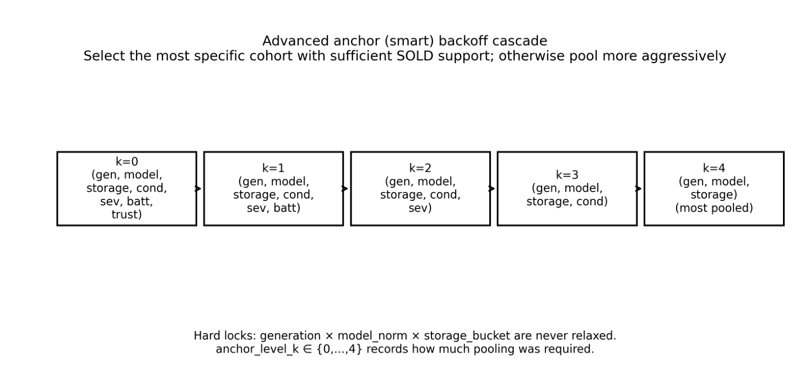

Historical figure H03. The earlier anchor design pools selected strata while retaining core item-family constraints, from PDF page 4 of the anchor chapter. The diagram specifies a construction policy; temporal availability must still be verified separately.

## Certification as a declared, executable guarantee

The governance papers propose a registry of feature entry points, structural identities, freshness checks, temporal invariants, and training preflight guards. Static analysis inspects dependency closures and forbidden expressions. Dynamic checks assess keys, null patterns, cutoffs, and data fingerprints. Consumption can fail when a block is stale or violates the declared contract. These mechanisms are valuable because they convert assumptions into repeatable checks at a boundary.

The strongest defensible guarantee is conditional: a named feature version passed named checks against named source versions at a recorded time. A schema digest establishes interface identity; it cannot prove that a source timestamp is truthful. A sampled dataset digest detects certain changes; it cannot prove the absence of changes outside the sample. A dependency scan can reject direct outcome columns while missing an enrichment process whose availability pattern indirectly reveals the outcome.

This qualification does not make certification unhelpful. It identifies the proof obligations that remain outside the automated checks. Raw content provenance, timestamp semantics, and external process behavior require evidence beyond a SQL view definition. The platform's historical missingness incident shows why the distinction matters: an apparently ordinary context block became predictive through its lifecycle-dependent availability, and successor exports explicitly removed it.

The detailed schema and leakage chapter develops these invariants and failure cases. Here the platform-level point is that contracts must compose. A valid numeric table and a valid vector archive do not automatically form a valid experiment if their keys are misaligned or their timestamps refer to different decisions. The compact public loader consequently aligns vectors by explicit row keys and rejects cross-partition entity overlap rather than relying on file order.

## Historical anchors and reconstructed inventory

Price anchors use completed comparable observations before the target decision, often in recent windows and with an embargo. The historical report illustrates thirty- and sixty-day windows and a five-day embargo. These are documented design settings, not evidence that five days covers every possible reporting delay. An embargo is effective only under a justified bound or probabilistic account of that delay. Availability timestamps remain preferable when they exist.

Inventory features count competing listings believed to be live at the decision. An offline history can retrospectively reveal that a listing stayed live between its first and last observation. That reconstructed interval may contain information that was not available at the earlier time. The correct prospective inventory is the one inferable from observations then, with an explicit staleness policy. A retrospectively reconstructed count can support exploratory analysis, but its result must not be presented as an operationally observable feature without that additional check.

These distinctions are especially important in a fast-changing market. Historical comparisons lose relevance; new stock changes the competitive set; missing evidence can delay a score beyond its useful window. Temporal correctness and freshness are therefore complementary. A perfectly historical but badly stale feature may be operationally weak, while a fresh current-state feature may be invalid for an earlier evaluation.

## Reproducibility across research and serving

An experiment manifest binds the data snapshot, raw-content versions, feature definitions, split rules, fitted preprocessing, model configuration, code revision, and output predictions. Reproducing a neural score requires more than the checkpoint tensors. Category vocabulary, numeric scaling, feature order, missing-value rules, slot selection, and output interpretation all influence the result. The inspected serving work preserves these contracts and tests numerical agreement across execution paths.

The platform also distinguishes current operational repair from historical scientific evidence. A corrected attribute should be available to future decisions under a new version. It should not silently rewrite an old final-test matrix and make the old prediction appear to have been based on corrected information. Reanalysis is legitimate when the correction and changed population are recorded. Confirmation then requires a cohort that has not already influenced those choices.

The public compact benchmark operationalizes a subset of this discipline: train-only preprocessing, chronological administrative censoring, identity checks, configuration selection on validation, and frozen selection before final-test prediction. Its three-block demonstration is smaller than the proposed four-block real-data design, which separates architecture selection from calibration and policy fitting. The distinction is explicit so that software completeness is not confused with a completed scientific comparison.

## Market movement and controlled adaptation

The retained platform has documented routes for feature refresh, new-record scoring, changed-input rescoring, model retraining, and threshold or calibration updates. These routes are forms of adaptation infrastructure. They do not establish autonomous online learning, a continuously optimized policy, or measured improvement after every update.

A controlled adaptation cycle first identifies what changed: the evidence distribution, event prevalence, observation process, or relationship between evidence and outcome. It then chooses the smallest justified intervention. Refreshing an inventory statistic differs from refitting a calibrator; a new encoder changes the representation contract; a new survival model changes the predictive function. Each update needs a version, a bounded evaluation, and a rollback path.

The research consequence is a prequential perspective: freeze a model, capture predictions before outcomes mature, evaluate the next cohort, and only then decide how to update. A rolling stream of such cohorts provides stronger evidence about adaptation than repeatedly optimizing one historical holdout. The platform supplies much of the machinery needed for that process. The remaining task is to use it under a sealed evaluation protocol rather than infer future reliability from successful feature refresh alone.


# Feature-store separation, reconstruction and evidence boundaries

## Three layers of the DDL release

The feature-store release separates historical implementation, public inventory and a portable temporal example. These layers answer different questions. The historical files show concrete engineering choices used in the recovered model-preparation system. The inventory makes the published SQL discoverable and exposes direct relation dependencies. The portable example demonstrates a smaller, explicit contract that can be built in an empty database and challenged with artificial counterexamples. Combining them into one undifferentiated claim of production reproducibility would obscure important missing adapters and version boundaries.

The existing public tree contains 66 SQL files across nine feature-store families. This release adds eight selected historical SQL implementations and five newly authored portable scripts. PostgreSQL AST inspection covers all 79 files: 77 parse as standalone SQL after documented client-directive normalization, while two existing anchor files require explicit query-fragment wrappers. All parse under the selected parser. The inventory detects 87 distinct qualified relation definitions and 82 qualified referenced relations across these scripts. Twenty-eight referenced names are not among those detected definitions. That last count includes system catalog relations and externally supplied surfaces; it is not a claim that 28 production tables are missing.

The machine inventory is a lower-bound structural map, not a reconstructed database catalog. Dynamic SQL inside procedures, relation names supplied as strings, unqualified names resolved through search paths, and some function-body dependencies require manual review. A syntactically valid statement can still fail because a column, extension, type, role or function is absent. Historical files also contain alternative revisions of related objects. Consequently, the inventory must not be treated as an instruction to concatenate every file and execute it.

## Coverage and the role of each feature family

The main feature store establishes the entity universe, decision origin and core listing attributes. Device metadata provides categorical and numerical descriptors and, historically, population context. Image stores aggregate per-image labels; fusion combines related evidence into a per-entity representation. Geographic and socio-economic modules supply released reference information and historical market context. Price and learned anchors express relative position or outcome-linked historical evidence. Trainer-derived features combine already governed inputs into the model-facing schema. Certification and export sit above these families and should preserve their identities rather than dissolve them into an undocumented flat matrix.

| Published family | Existing SQL files | Principal contract and remaining dependency |
|---|---:|---|
| Main | 3 | Entity and decision-time keys; source observations and lifecycle semantics are external |
| Device metadata | 1 | Encoded descriptors and population transformations; source history and unsafe legacy blocks need review |
| Image features | 4 | Per-image to entity aggregates; image assets, labels and encoder outputs are adapters |
| Damage fusion | 7 | Cross-source evidence fusion and certification; upstream image and listing surfaces required |
| Geography | 15 | Versioned reference releases, pinned views and guards; reference content must be supplied |
| Socio-economic/context | 15 | Historical market/context surfaces and invariants; base history and release policies required |
| Price-anchor priors | 4 | Earlier-event comparisons, support and fallback rules; two files are query fragments |
| Learned weight-of-evidence anchors | 11 | Fit registry, folds, bands, scoring and certification; fitted values and membership proof are excluded |
| Trainer-derived | 6 | Deterministic feature combinations and governed entrypoints; compatible certified inputs required |

This family separation is methodological as well as organizational. A defect in an image report's availability should be traceable to that block, not hidden in hundreds of unnamed columns. A geographic release must have a publication policy distinct from a learned anchor's fitting policy. A trainer-derived ratio can be deterministic and still unsafe when its numerator or denominator came from a later revision. The feature catalog therefore needs keys, source versions, availability rules and consumer eligibility for each block, alongside familiar types and dimensions.

## Historical SQL preserved in the new reference

The selected Stage2 additions contain actual SQL for deterministic image-role mapping, English image reports, eight-slot selection, coverage manifests, price-anchor history and fallback computation, channel flags and temporal priors, refresh ordering, and price-anchor validation. They preserve substantive expressions, window logic, indexes, table definitions and materialized views. These are not placeholders that simply state that a feature store should exist. The provenance record identifies original bytes through SHA-256 and identifies the public derivatives through canonical UTF-8/LF hashes.

The transformation is explicit. Source-specific identifiers were generalized, original operator invocation comments were removed, and an explanatory evidence-boundary header was added. A seller-reference INSERT containing private seed records was removed completely. The public table remains empty; no pseudonymous substitute rows were introduced. That omission changes which optional profile flags can become active until an adopter supplies a lawful, appropriate reference. It does not change the arithmetic of the remaining matching and historical-prior expressions. No credentials, raw source records, embeddings or fitted private anchor values are included.

Recovered preparation scripts were inspected as orchestration evidence rather than copied into an apparently portable recipe. Their refresh and certification calls assume a larger database, specific aliases, operator variables and mounted export tooling. A legacy global population-comparison script is also excluded from active rebuilding: it is a diagnostic contrast that lacks a full decision-time identity. The source hashes record these reviewed dependencies and exclusions. The absence of their execution from this release is intentional and disclosed, rather than concealed behind an assertion that every production object has been recovered.

## Image and report evidence must keep its temporal identity

The historical image path first maps image evidence to roles and surfaces, then constructs reports and a deterministic eight-slot contract. Separate slot and report versions make the shape and selection policy inspectable. The model can receive an image vector, a report-text vector and explicit availability indicators for each slot. This design retains more structure than an unlabelled pooled vector and supports meaningful completeness checks. It does not by itself establish when the underlying image or report became available.

The recovered report builder draws on current role and enrichment sources and records a construction timestamp. That timestamp is useful for operations but cannot substitute for the original availability of each input. A historical rebuild may legitimately recompute a deterministic representation from immutable evidence; it must then prove content identity and pin the encoder and extraction rules. If the image set or descriptive text changed after the target origin, a perfectly shaped vector can still contain future information. The leakage chapter develops this distinction through the observed population-feature failure.

The portable contract therefore stores source and encoder digests, evidence time, availability time, revision and slot number. Its query chooses only versions whose evidence and availability are both no later than the decision origin. It emits eight positions even when most contain no evidence, and it keeps image and report availability separate. Four-dimensional artificial vectors exercise these rules in the example. They are not an approximation of the historical 512- and 768-dimensional encoder outputs and must never be used to justify padding or truncating an incompatible production vector.

## Context, priors and learned anchors require different cutoffs

Historical priors derive information from other entities whose outcomes are already known. The selected price implementation builds indexed helper materializations, groups prior support, selects fallback levels and computes exact percentiles where needed. The faster channel implementation preaggregates daily counts and sums, then obtains earlier-window rates and mean durations through lateral joins. Its earlier-day predicate excludes the target day conservatively. These are concrete measures against including a target's future outcome in its own explanatory context.

However, an event-date cutoff alone does not ensure that the outcome was known by the target origin. The portable example adds an availability cutoff and excludes the target entity explicitly. A record whose event happened earlier but was discovered later is excluded. An earlier row from the same entity is also excluded from the example prior. These choices are visible in SQL and exercised by artificial counterexamples. They are stronger assumptions than can be proven for every recovered historical table, so the example is described as a new contract rather than a verbatim reproduction of the original pipeline.

Learned anchors introduce another boundary. A weight-of-evidence value, fitted price model or calibrated prior can carry target information through its training membership even if its lookup table contains no explicit outcome column. A timestamp marking the fitted artifact is not enough without knowing which entities and labels were used. The existing anchor package contains registry, fold and scoring structures; its private fitted values are deliberately not distributed. The portable example accepts only a forward-disjoint artifact fitted and label-matured before the target time. It does not treat an `out_of_fold` string as proof of actual disjointness.

Geographic information has a related but distinct issue. A release may describe an earlier year while being published later. Selecting it solely by the year described can introduce future knowledge into a historical prediction. The reference therefore requires both validity and publication boundaries. The exact release policy depends on the intended experiment: using a modern geographic encoder for a retrospective representation study is not identical to claiming that the representation was available for a historical operational decision.

## Rebuild ordering and adapter responsibilities

The conceptual dependency graph begins with versioned entity observations, image labels, encoders, geographic releases, market history and fit membership. Main and image/report blocks can then be constructed, followed by context and anchors, then trainer-derived assembly, certification and frozen export. A compatible historical rebuild must choose one revision per surface and satisfy the actual source columns and functions it references. The included rebuild plan expresses review waves rather than pretending that a single numeric order resolves every historical dependency.

The portable sequence is genuinely ordered: source contracts, point-in-time views, history and anchor assembly, certification, then the artificial fixture. It creates three isolated schemas and no connection configuration. It does not create extensions, contact external services, download reference data or infer deployment credentials. Its source tables define the complete inputs needed by that example, so the initial schema can be created in an empty database. A user who adapts it to a real deployment must supply the source observations and version histories rather than backfilling invented availability times to make tests pass.

Several boundaries remain explicitly outside the portable example: natural-language or image labeling models, content capture, vector computation, external reference licensing, seller-identity resolution, the full set of historical model columns, production indexing at scale, job scheduling, permissions, and model-specific queue policies. The schema also does not prove that a caller's claimed content digest corresponds to immutable original evidence. Those are application and operational responsibilities. Documenting them is more useful than asserting complete reconstruction from a subset of SQL files.

## Certification checks are bounded assertions

The recovered governance design uses definition baselines, dataset baselines, status registries and freshness requirements. The preparation scripts check several named feature blocks, with some blocks sharing one certified entrypoint. A list of eleven block labels should therefore not be interpreted as eleven independent proofs of temporal validity. The checks establish the properties they actually measure: presence of required objects, approved definitions, matching sampled content or a current registry status. Their interpretation depends on how baselines were selected and reviewed.

The portable certification procedure checks selected invariants and records row count, a deterministic content digest, a view-definition digest and an expiry time. Its guarded read function performs the certificate check before returning rows, including when the feature table is empty. This avoids treating an empty query result as evidence that a guard executed. Changing source content invalidates the saved digest, and an expired certificate is rejected. These behaviors are tested in the isolated execution record.

The example hashes use built-in MD5 for compact change detection, not cryptographic attestation or resistance to an adversarial writer. A production design should select the appropriate digest, permissions, append-only approval record and transaction isolation. Reads that must bind validation and data extraction to one snapshot should use a reviewed transaction policy, such as repeatable read, and account for concurrent refreshes. The fixture does not exercise concurrency, malicious database administrators or hardware failures. Above all, a certificate cannot prove the truth of timestamps supplied by the source or discover every lifecycle-dependent missingness mechanism.

## What was executed, what was parsed and what remains unproven

The complete public inventory was inspected with a PostgreSQL AST parser. Client-only directives and variables are normalized for syntax inspection and the counts of those transformations are recorded. Two pre-existing lateral snippets are wrapped in minimal query contexts; their parsing does not establish that the caller's `base` relation or column set exists. The resulting relation graph omits dynamic dependencies, and the parser does not perform semantic analysis of every SQL or procedural body. These limits are part of the output rather than footnotes hidden behind a passing test.

The five portable scripts were also executed against an isolated, in-memory PostgreSQL 18.3 engine supplied by PGlite 0.5.8. That execution opened no production database connection, started no service and required no network socket. The artificial fixture validated seven mechanisms: rejection of a late listing revision, eight-slot shape, exclusion of a late image, exclusion of a late geographic release, historical availability and self exclusion, exclusion of a late label correction, and exclusion of a fitted anchor with future label knowledge. Additional reads confirmed rejection of an uncertified empty store, changed content and an expired certificate.

The execution report records the engine and files used. It is evidence that this small portable design can be created and exercised, including procedural guards, in an actual PostgreSQL-derived engine. It is not evidence that the eight archived historical scripts can run against an empty database, that native server extensions and performance match the in-memory engine, or that production query plans are efficient. No private database was restored, no model jobs were launched and no historical source tables were mutated.

The resulting release is therefore substantial but bounded. It contains real historical SQL, an explicit inventory, source hashes, dependency and rebuild guidance, complete artificial source contracts, executable temporal examples and reproducible validation. It preserves the distinction between an advanced operational feature system and a fully proven historical information boundary. The observed leakage counterexample motivates that distinction: maintaining it is part of methodological rigor, not a dismissal of the engineering embodied in the stores.


# Generative enrichment as a measurement system

## Seeing condition at the scale of an operational dataset

A market listing is only partly represented by its structured fields. The same nominal item can have a damaged rear panel, an intact front, a protective layer, missing accessories, uncertain packaging, or an ambiguous battery display. These details affect how a person interprets the offer, yet many are expressed only in a photograph or a short, informal description. A survival model restricted to price and a categorical condition label cannot recover every distinction. The enrichment system was built to turn this otherwise difficult-to-use evidence into explicit, versioned measurements.

The retained snapshot contains 240,622 image-asset rows, 228,958 image-feature records, and 54,841 structured text-enrichment records associated with a listing store of 55,260 rows. These are different units and coverage populations. They demonstrate that visual and textual interpretation was a substantial production workload; they do not constitute 228,958 independently verified visual labels. A feature record is a machine-produced interpretation with a particular prompt, input, execution time, and revision. It becomes a useful research input only when those dependencies are preserved.

The practical description of the system as using artificial intelligence as its eyes is apt when interpreted operationally. Repeated visual judgments that would otherwise require individual inspection are converted into constrained fields and short evidence summaries. The system does not observe hidden components, infer a verified transaction, or establish the truth of a seller's claim. It interprets what is visible and what is written. The distinction is fundamental: generated attributes are measurements with error, not newly discovered ground truth.

Three separate computational layers participate. First, generative vision and language workers construct interpretable attributes. Second, frozen encoders map images, canonical listing text, and normalized image reports into vectors. Third, the survival network learns a relationship between the available attributes and vectors and a censored time-to-event target. The inspected implementation does not train a foundation model end to end on sale outcomes. Its research contribution lies in the contracts and learned fusion between these layers, together with the operational system that makes them consistently available.

## Decomposing visual interpretation into bounded tasks

The visual pipeline separates damage, accessory, and color or identity analysis. This is more than a convenient code organization. Each worker owns a limited field set, and a successful update must not overwrite a field owned by another worker. Damage analysis owns visible damage, photo quality, background clarity, stock-photo status, protective-layer evidence, and a short damage summary. Accessory analysis owns packaging, charger and cable evidence, other accessories, receipt evidence, battery-display interpretation, and related confidence fields. Color analysis owns body-color observations and tightly controlled identity-correction proposals.

This separation constrains the space in which an individual generative response can cause harm. A well-formed accessory response cannot silently clear an existing damage assessment. A color proposal cannot become a general authority to rewrite every product attribute. The database writer, not the language model's prose, determines which columns may change. Restricting ownership is an effective engineering control even when the underlying model remains probabilistic.

| Interpretation task | Representative outputs | Important boundary |
|---|---|---|
| Visible damage | Damage level, summary, protective-layer flags | Describe visible evidence; do not infer internal function |
| Image quality | Photo quality, background clarity, stock-image flag | Quality and authenticity cues are distinct from physical condition |
| Accessories and packaging | Box, cable, charger, case, receipt, seals | An object must be visible; absence of evidence may be uncertain |
| Battery display | Relevant screenshot flag and percentage | A generic settings screen does not establish battery health |
| Color and identity | Body color and confidence, correction proposal | Conflicts with independent evidence require a stronger guard |
| Text interpretation | Structured assertions and condition evidence | A seller statement remains an assertion rather than verified fact |

The accessory prompt handles a bounded set of images for one item and requests evidence at image level. It discourages false positives and constrains fields to a prescribed representation. A battery value is either an integer within the specified admissible range, 50-100 in the inspected contract, or null. The worker must establish that the relevant display is visible. This converts an unconstrained narrative task into a classification-and-extraction task with explicit abstention.

The same principle applies to damage. Distinguishing damage on a protective layer from damage on the underlying surface prevents a plausible sentence from becoming an unjustifiably strong physical-condition label. Background clutter is tracked separately from item condition. A stock illustration can communicate identity while providing weak evidence about the particular item's wear. These distinctions create features the downstream model can use and, equally importantly, distinctions an auditor can inspect.

## Prompt constraints, validation, and residual uncertainty

Prompt engineering in this system is a form of interface design. The model receives a bounded task, a field taxonomy, evidence instructions, and a structured response contract. Deterministic application code then parses, validates, and writes the response. The field contract reduces variation in spelling, label granularity, and narrative style, making repeated outputs easier to compare. It also supports selective retry: a malformed response need not become an accepted database record.

The inspected current private accessory worker requests a fresh response once after a JSON parse failure and raises an error if that repeated response is still unusable. The earlier public reference worker instead parses once and raises, so this retry behavior must remain tied to the inspected current source receipt. Its database helper can clear a failed connection and retry a connection operation once; other database exceptions roll back and propagate. Per-item errors are recorded while the larger loop continues. Completion is marked only after positive insertion progress. These are specific observed mechanisms, not an assertion that every worker has identical retry counts or complete transactional equivalence.

The damage worker has a bounded request timeout and similarly isolates item-level failures. Versioned image/report-vector records retain separate success flags, error text, and timestamps for the two representations. A report-vector failure can therefore be distinguished from an image-vector failure. Successful replacement can clear the relevant error rather than silently leaving a contradictory status. This is important for research because an apparently missing modality may reflect a pending job, a permanent input defect, or a failed execution, each with a different operational meaning.

Neither a low-variation generation configuration nor a JSON schema proves correctness. Structured wrong answers remain wrong. Repeated requests can differ because of backend changes, numerical behavior, or ambiguity in the input. The manuscript therefore describes constrained and repeatable generation, rather than mathematical determinism. It also avoids a zero-hallucination claim: no complete independently adjudicated error study was recovered for the full enriched population.

A useful decomposition of enrichment error is

$$
P(\widehat A\ne A)=P(\widehat A\ne A\mid Q=1)P(Q=1)+P(\widehat A\ne A\mid Q=0)P(Q=0),
$$

where $A$ is a target attribute and $Q$ indicates whether the supplied evidence is sufficient for a competent judgment. The expression emphasizes that model behavior and evidence sufficiency are separate. Prompt refinement may improve the first term without repairing an unreadable photograph. Explicit unknown values, quality measures, and abstention policies are therefore part of the measurement design rather than incidental missing data.

## Learning from an actual identity-correction failure

The retained development record documents a concrete failure in which an image interpretation overrode a title, description, and high-confidence text classification that agreed with one another. The proposed correction was a move to a higher tier within the same item family. Treating that case as a model improvement would have hidden a real evidence conflict. The implemented response was to make the override substantially harder and auditable.

The successor rule requires at least 0.95 model-reported confidence, at least two clear non-stock image-feature rows, a quality level of at least three, no stock-photo rows, and a rationale tied to relevant visible hardware evidence. The guard is applied in the specific situation where title, description, and text quality-control evidence form a consensus. Applied and skipped proposals are logged, and the mistaken change has a documented reversal record.

The confidence threshold is a control input, not a calibrated probability of correctness. Its value is that it participates in a conjunction of independent, inspectable conditions. Even a high self-reported confidence cannot bypass the requirements for multiple suitable views and conflict-aware evidence. The incident also illustrates why historical replay requires versioned rules: an older dataset may contain the original interpretation, the erroneous correction, or the repair, and these are not interchangeable at every decision time.

The scientific evaluation of such a guard should report the number of proposals, accepted overrides, rejected overrides, adjudicated correct changes, and unresolved cases, stratified by conflict type. The current evidence demonstrates a diagnosed failure and an implemented response. It does not provide enough adjudicated examples to estimate the guard's sensitivity or specificity precisely. That distinction preserves the engineering achievement without turning an incident fix into an unsupported accuracy statistic.

## Text interpretation and resource-aware decomposition

Text can supply direct condition statements, references to a defect, accessory descriptions, and uncertainty about operation. These statements can be normalized into structured fields and compared with visual evidence. The pipeline also constructs canonical encoder input from tagged title, description, and caption fields. Field tags retain some source structure, helping distinguish a short title from a longer condition account even when both eventually contribute to one vector.

The operational design uses recurring, incremental workers rather than repeating every expensive transformation at each survival prediction. The documented text worker has a 300-second loop in an active daily window. Text-vector construction skips unchanged canonical text using a content hash and refreshes when relevant caption evidence arrives. Reuse of stable intermediate representations is a credible resource-saving mechanism. The retained material does not, however, establish a complete per-item token bill or a controlled comparison of alternative providers and models. Descriptions of low-cost understanding should therefore be interpreted as a design objective unless accompanied by measured accounting.

A short textual statement can often resolve a condition ambiguity that would otherwise require several visual calls. Conversely, an image can contradict an optimistic description. The value of the multimodal design is that these sources need not collapse into a single unqualified truth field. A statement-derived condition, a visible-damage measurement, and their disagreement can remain distinct inputs. Their combination lets the survival model learn whether the disagreement is predictive while allowing human review of the underlying evidence.

This separation also supports a principled evaluation budget. Attribute-level annotation can concentrate on high-consequence or contradictory cases. Random sampling remains necessary to estimate ordinary error rates, while targeted review can find failure modes. Neither targeted examples nor a visually persuasive demonstration panel provides a population error estimate. The public examples accompanying the thesis illustrate actual evidence-to-judgment relationships under this constraint.

## From image judgments to eight structured evidence slots

The later multimodal design preserves image diversity through a fixed eight-slot representation. It selects at most one image for each primary role: front, rear or camera region, side or frame, damage, battery display, and accessories. Remaining slots are filled using quality and evidence preferences. The same image is not duplicated merely because it satisfies multiple roles; its metadata can preserve those multiple interpretations. Missing positions are padded and accompanied by explicit masks.

For each selected image, a canonical English report summarizes normalized structured facts. This report is not simply the raw seller description repeated beside each photo. Role mapping can use caption or text cues, but the report contract is based on the structured image analysis. The distinction matters because otherwise the supposed image-report branch could repeatedly amplify a seller's single assertion and appear to provide multiple independent observations.

The documented tensor interface is

$$
V^{\mathrm{img}}\in\mathbb R^{8\times512},\qquad V^{\mathrm{report}}\in\mathbb R^{8\times768},\qquad M^{\mathrm{img}},M^{\mathrm{report}}\in\{0,1\}^{8},
$$

with additional role and quality metadata. The two availability masks remain separate because an image vector can succeed while its report vector fails, or vice versa. The report and image vectors are aligned by item, slot, content version, and encoder revision. A shape match alone cannot prove alignment; the key and content hash are necessary parts of the contract.

An undated documented build recorded 44,939 listing manifests and 359,512 slot rows, exactly eight per manifest. It classified 42,487 manifests as ready and 2,452 as requiring weaker or additional evidence. Of the slot rows, 146,735 were padding; the other roles included 41,450 front, 40,747 rear, 15,332 side, 10,386 damage, 9,409 accessory, 3,036 battery, and 92,417 additional-image slots. These numbers describe a particular build population. They are not the denominator of the retained database snapshot or the final evaluation cohort.

A separately documented selected interval, March 21 through April 10 by event date, contained 2,458 listings, 2,450 manifests, and 2,313 ready manifests. The mean number of actual slots was 4.853, and 455 manifests had all eight real slots. These counts are useful evidence of real variable-length image sets. Selection by observed event date also means they should not be generalized to the initial live population without accounting for censoring and availability.

## Frozen semantic vectors and the meaning of whitening

The inspected image/report builder uses a frozen image encoder for 512-dimensional visual representations. Its language branch pools token-level hidden states using the attention mask, normalizes the pooled vector, and runs without gradient updates. The recovered listing-text job similarly constructs a 768-dimensional, normalized vector from canonical text. These are semantic representations produced by pretrained encoders; the supervised survival learner receives them as inputs.

Contrastive image-language pretraining offers a relevant precedent for reusable visual representations: Radford and colleagues (2021) show how paired language supervision can produce transferable visual features. That precedent motivates representation reuse, not a claim that the present system repeats the original pretraining experiment or inherits its published performance. [Radford et al., 2021](https://proceedings.mlr.press/v139/radford21a.html).

The operator also describes an ordinary-plus-whitened text-vector design. Whitening is a covariance transformation, not random white-noise augmentation. For a training-estimated mean $\mu$ and covariance eigendecomposition $\Sigma=U\Lambda U^\top$, a regularized transform may take the form

$$
z_{\mathrm{white}}=(z-\mu)U_r(\Lambda_r+\epsilon I)^{-1/2}.
$$

The ordinary vector can preserve the original embedding geometry while the transformed branch reduces dominant correlated directions. Whitening is studied as a sentence-representation transformation in its own right. [Huang et al., 2021](https://aclanthology.org/2021.findings-emnlp.23/).

The selected inspected neural contracts expose one listing-text vector of width 768. A fitted whitening artifact or two independently wired listing-text branches was not recovered in the bounded source audit. Accordingly, the ordinary-plus-whitened account remains an operator-described upstream design that requires artifact-level confirmation. It is not silently converted into an architectural claim about the selected network. A reproducible implementation would preserve the fitted mean, basis, eigenvalues, dimensionality, regularization, and training-population hash. Fitting these transforms using future cohorts would introduce distributional information even without outcome labels; the controlled benchmark requires train-only fitting.

## Availability, repair, and the boundary around outcome information

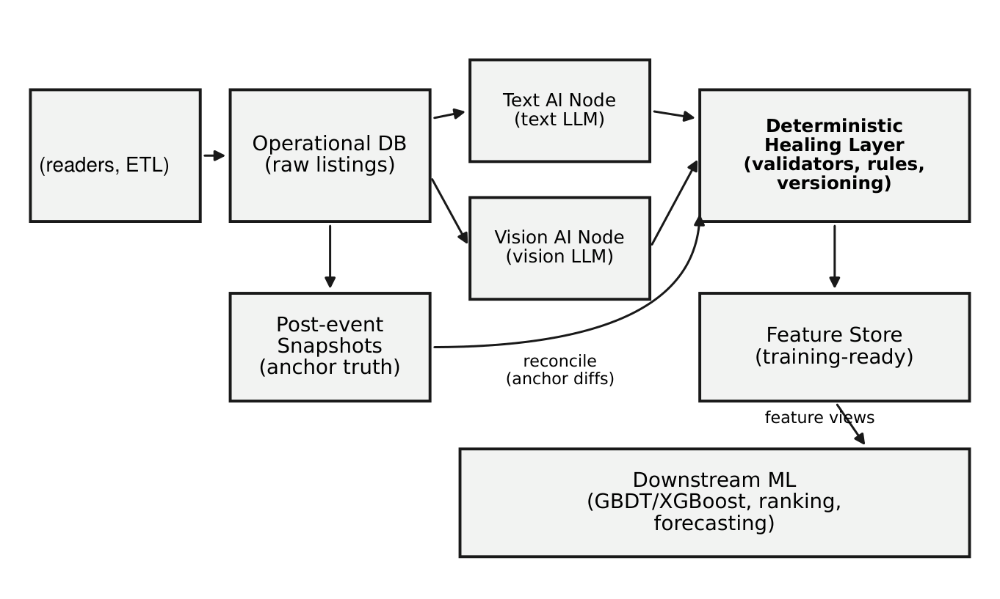

Historical figure H08. A tightly cropped historical diagram shows separate text and vision interpretation, deterministic validation and merging, and later snapshot reconciliation. Its post-event reconciliation path is an audit and repair mechanism. It does not authorize using post-event facts in a feature vector for an earlier decision; every such input still requires a separate decision-time availability check.

The architecture's ability to repair data creates a temporal responsibility. A later audit can correct current records and improve future predictions. It cannot make an older score retrospectively informed by a fact that arrived after the outcome. Completion timestamps, raw-content hashes, transform revisions, and field ownership must therefore travel with the features. A successful worker execution is evidence that computation occurred, not evidence that its output was available at every earlier origin.

This is particularly important when enrichment scheduling depends on lifecycle state. If a context block is populated only after a terminal event, its missingness may reveal the outcome even when its numerical values look harmless. Historical audits identified and removed such a route in later exports. The appropriate lesson is to test both values and availability patterns, then confirm the revised pipeline on a new cohort. The leakage chapter develops that case in detail.

## What the enrichment system establishes

The retained evidence supports a substantial, functioning measurement pipeline: hundreds of thousands of image records, structured visual tasks, field ownership, retries, incremental vector construction, explicit slot contracts, and incident-driven correction rules. Its scientific role is to make heterogeneous evidence consistently available to a censored-outcome experiment. That role is valuable independently of which survival estimator ultimately wins.

The next controlled evaluation should measure two linked questions. First, how accurately do the generated attributes represent visible or stated evidence, including abstentions and disagreement? Second, what incremental predictive value do those attributes and representations provide after temporal validation, relative to structured features alone? Separating these questions prevents an attractive explanation from being mistaken for a correct measurement and prevents a correct measurement from being assumed useful for predicting duration. It also makes the central research hypothesis testable: that carefully governed visual and textual evidence improves decisions enough to justify its operational cost.


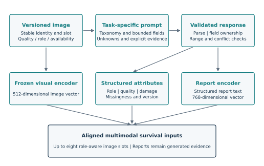

# Real visual evidence and structured judgments

## Why include actual photographs

The image pipeline was intended to act as a scalable visual inspection layer. A product photograph contains information that is difficult to capture through a small fixed set of seller-supplied fields: cracks, reflections, protective covers, packaging, framing, accessories and whether a useful surface is visible at all. The pipeline converted this information into bounded judgments and short descriptions that could be stored, inspected and represented numerically. The examples in this chapter use retained photographs and saved model outputs, rather than generated illustrations.

The release selects two cases from a retained image-evidence snapshot generated on 18 April 2026. That snapshot contains 42,082 listing-level rows with nested per-image judgments; this is a different unit and date from the later platform-wide image-asset count. Local image files were matched through the private record key and stored image index. The private keys, source URLs, external-drive paths and original filenames are omitted from the public examples. Public files use anonymous case labels and carry image hashes in the evidence manifest.

This pairing has a material limit. The retained snapshot did not provide an immutable image-byte digest recorded at inference time. Agreement of record key and image index, supported by visual consistency, is weaker than a content-hash join. The examples therefore illustrate the saved output contract and its interpretability. They are not a blinded image benchmark, an estimate of accuracy or proof that every original input byte was recovered. Cases with obvious content/index inconsistency were not used as evidence of model correctness.

## Case A: visible damage converted to a bounded record

Case A shows a front surface with visible cracks. The saved model summary reads: **"front screen cracked with visible cracks"**. Its stored `visible_damage_level` is 2, `photo_quality_level` is 3, and `damage_on_protector_only` is false. A separate `image_damage_level` field is null. These values belong to different fields and scales; the null must not be filled by copying the visible-damage value merely because both names mention damage.


The associated local image caption states, in translation with the product name generalized, "Almost new [device]." The visible cracks show why this broad condition description cannot substitute for visual inspection. This is an illustrative evidence conflict, not a finding of intentional deception. Nor does an illuminated display establish complete functional condition: visible damage can coexist with an undisclosed internal fault or repair history that cannot be seen.

This example explains why feature construction should retain both the structured fields and the report. The bounded ordinal fields are easy to aggregate and validate. The report preserves a more specific location and visual pattern. A text encoder can represent those semantics for the survival model, while the original image encoder provides a separate visual representation. The generated report is an intermediate interpretation of the image, so its errors may be correlated with visual difficulty rather than independent noise.

## Case B: visibility limits must survive the pipeline

Case B shows an inactive display with strong reflections. The saved summary reads: **"Screen off with strong reflections and some smudges/dust; no clear scratches or cracks visible."** Its stored visible damage level is 2, photo quality level is 2, and protector-only flag is false. The separate image-damage field remains null.


The photograph makes the distinction between absence and non-observation concrete. A bright reflection can obscure scratches. An inactive display cannot establish that the panel works. A clean-looking region does not certify surfaces outside the frame. An operational narrative that rewrites this output as "damage-free" would remove information that the image model correctly left uncertain.

The structured value also warrants scrutiny: a visible-damage score of 2 accompanies a summary that reports no clear crack or scratch. Without the original rubric, that number should not be translated into an intuitive label such as "moderate damage." A robust contract carries the rubric version, field meaning and raw interpretation together. The current case study preserves the recorded values and uses the mismatch as a reason to inspect semantics rather than an excuse to invent a more flattering interpretation.

## From per-image outputs to listing representations

A listing may contain several photographs that provide complementary or conflicting evidence. One may show the rear surface, another the front, another packaging, and another a settings screen. Aggregating these into a listing-level feature requires role-aware rules. A packaging image should not certify the condition of an unseen device. A screenshot of a generic settings page should not be treated as proof of a specific battery metric. A stock image should not be substituted for a photograph of the offered item.

The documented system addressed these distinctions through image-role labels, bounded attribute extraction, damage descriptions, quality fields, explicit missing values and downstream narrative rules. The later selected neural model used up to eight image vectors and eight image-report vectors. Retaining slots preserves more information than collapsing all photographs into a single unqualified maximum damage score. It also creates new responsibilities: slot ordering, vector dimensions, mask semantics and report-to-image alignment must remain stable between training and serving.

A model-produced score is not a probability merely because it is numeric. Ordinal damage and photo-quality fields should be encoded according to their documented scales. A confidence field requires calibration before it can support probability claims. Averaging incompatible scales across versions produces a precise-looking but uninterpretable feature. The feature store must therefore preserve producer versions and transform contracts alongside values.

## What would demonstrate performance at scale

These examples demonstrate inspectability, not measured hallucination suppression. A quantitative evaluation would select a representative image sample before examining model success, obtain independent annotations with adjudication, and report disagreement by image role, visibility, damage type and product subgroup. It would separately measure invalid schema outputs, unsupported specific claims, missed damage, incorrect localization and repeated-run variability. Each denominator must be explicit.

For text damage analysis, the parallel study should distinguish direct seller statements, negation, repaired historical damage, current functional faults and uncertain language. A short sentence about a replaced component must not be reclassified automatically as a current fault. Cross-modal agreement is useful, but correlated evidence must not be counted twice as independent confirmation.

The practical value of the implemented design is that it preserves material for these checks. Structured outputs, explanations, original content and downstream tests make it possible to investigate an error. The next research step is to quantify how often each error occurs and whether additional visual and semantic representations improve survival forecasts under an identical temporal protocol.

# The three-stage survival cascade: implementation, training and interpretation

## Scope and evidence

The historical cascade is an implemented sequence of three multimodal survival models and their decision policies. Stage0 identifies long-persistence cases around a 504-hour boundary. Stage1 separates faster and slower cases around 168 hours among records passed downstream. Stage2 makes the final 72-hour selection. Each stage contains a neural event-time model; the cascade is not simply three comparisons applied to one shared prediction vector. Separate heads, checkpoint combinations, calibration choices and thresholds create separate score channels with different training and selection populations.

The public package preserves numerical implementations and provides a complete portable path through feature preparation, stage fitting, validation, probability combination, policy selection, sequential prediction and local model-bundle persistence. It does not distribute fitted private weights, category vocabularies, row-level observations or source-specific ingestion and infrastructure adapters. A new training controller is explicitly distinguished from the preserved numerical code. Reproducing an earlier run also requires its exact input snapshot, fitted transformations, trial settings and random state; executable architecture alone does not reconstruct those artifacts.

The evidence has three levels. First, `provenance.json` records full source-file hashes, original definition ranges, source-span hashes, abstract-syntax-tree hashes and canonical export hashes. Its selected definitions include the actual legacy network, survival functions, three stages' numerical policies, calibration functions and routing. Second, `historical_evidence.json` contains safely selected numerical configuration from inspected historical manifests, with the manifest hashes retained. Third, artificial execution tests verify the new portable adapters. These levels establish different things: source identity, historical configuration and current software behavior respectively. None alone establishes prospective predictive accuracy.

The recovered Stage1 trainer has exactly the source hash recorded in its historical PhaseA manifest. The full base-module hash referenced by that manifest differs from the recovered base available for export. This difference remains visible rather than being hidden behind a claim of complete original-run reconstruction. The nineteen exported Stage2 training functions were also compared against an earlier recovered Stage2 trainer: their syntax-tree hashes match, despite differences elsewhere in the later file. This corroborates continuity of those numerical routines across the legacy and later slot-aware implementation.

## Architecture of the legacy stages

The legacy backbone accepts numerical features, categorical integer identifiers, one 768-dimensional listing-text vector and one 512-dimensional image vector. Upstream embedding encoders are outside this network. Their pretrained parameters are not counted as trainable survival-model weights, and their execution is not joint end-to-end training with the survival loss. The model assumes that the supplied representations and tabular values obey a fixed feature contract.

Numerical feature tokenization learns a separate affine representation for each scalar. Categorical values index a distinct embedding table for each categorical column. The feature-token variant retains the individual tokens. The compact variant first constructs those representations and then uses learned queries to pool numerical and categorical groups into a smaller fixed number of tokens. This is learned attention pooling, not a simple average of every input column. It reduces the token count entering the main fusion network while allowing different feature groups to contribute differently.

Text and image vectors are projected into multiple tokens. Eight text tokens in a selected configuration are eight learned projections of one listing-level embedding; they are not eight independently encoded paragraphs. Similarly, the legacy image path projects one supplied image representation. The later slot-based architecture instead accepts multiple individual image and report vectors, which changes both its information representation and missingness contract.

The fusion network initializes a learned latent array. Each block cross-attends from the latent queries to the input tokens, then performs self-attention and feed-forward processing over the latent sequence. Layer normalization and residual connections stabilize the repeated transformations. Pooling the final latents produces the shared representation supplied to the hazard experts and an independent scalar classification head. This pattern concentrates multimodal interaction in a fixed latent space; it does not demonstrate by itself that the interaction improves accuracy.

An inspected older Stage0 serving-bundle member and an inspected Stage1 PhaseA manifest both specify width 256, 32 latent tokens, nine fusion blocks, eight attention heads, seven dense hazard experts and 128 linear time bins over 504 hours. They use eight numerical-summary tokens, eight categorical-summary tokens, eight text tokens and eight image tokens: 32 input tokens in total. These are recovered configurations, not source defaults and not a claim that every trial shared those values. The metadata of the six selected Stage0 bundle members is published separately so that differences can be inspected rather than averaged away.

The expert layer is dense: every expert network runs for every scored row. Its softmax gate allocates nonnegative mixture weights that sum to one. It is not sparse expert dispatch and does not provide a corresponding sparse-computation saving. The scalar head shares the fused representation but has its own final linear map. Training this scalar head requires a loss connected to that output; a survival-curve loss alone does not train its separate final parameters.

The legacy forward method accepts optional text and image masks but does not use them to suppress attention. Missing vectors therefore require a fixed upstream representation. This behavior is preserved. It must not be described as the later slot model's explicit missing-token mechanism. The later model zeros unavailable slot values and adds learned missingness, position and modality information while retaining the resulting tokens in attention.

## Event-time distribution and censor-aware likelihood

Let the time boundaries be $0=b_0<b_1<\cdots<b_K$. For expert $m$, the network emits an interval hazard $h_{imk}$ for row $i$. Its meaning is the conditional probability of an event in the interval $(b_{k-1},b_k]$, given survival to its left boundary. Expert survival at a boundary is

$$
S_{im}(b_k)=\prod_{j=1}^{k}(1-h_{imj}).
$$

The gate weights $\pi_{im}$ mix complete expert distributions:

$$
S_i(t)=\sum_m\pi_{im}S_{im}(t),\qquad \sum_m\pi_{im}=1.
$$

The implementation does not average expert hazard logits and then treat that result as the mixture distribution. For an observed event in interval $k$, an expert contributes $S_{im}(b_{k-1})h_{imk}$. The sample likelihood mixes these event probabilities across experts. Its logarithm is evaluated with log-sum-exp after clipping probabilities for numerical stability. A nonincreasing survival curve follows from this construction. Calibration does not follow automatically.

For a censored observation at $t=b_{k-1}+u(b_k-b_{k-1})$, the code retains partial-bin exposure:

$$
S_{im}(t)=S_{im}(b_{k-1})(1-h_{imk})^u,\qquad 0\leq u\leq1.
$$

This is linear interpolation in log survival, corresponding to a constant event rate inside an interval. Observed events still contribute interval probability rather than continuous-time event density. The combined convention should therefore be described as a discrete-event objective with fractional censor exposure, not as an exact likelihood for precisely observed continuous event times. Analytical tests cover interval events, partial exposure, expert mixtures and censoring at finite support.

Events beyond the modeled support become censored at the support boundary before the loss is called. The raw archived likelihood helper assumes that its caller has already performed this outcome transformation; it does not automatically reinterpret every late event. The portable adapter performs that transformation explicitly. Its prediction interface rejects extrapolation beyond the fitted horizon. Under 504 hours divided into 128 linear bins, the interval width is 3.9375 hours, so 72 hours is evaluated by interpolation rather than being an exact bin boundary.

Point summaries have their own limitations. The archived expected-time helper allocates remaining probability mass to the finite horizon and uses within-bin approximations. It is decorated with `no_grad`, so it cannot supply a differentiable expected-time training penalty. The portable objective deliberately does not advertise that optional historical MAE term as an active learning component. Preserving a helper for reporting does not establish that its corresponding optional training argument had the intended gradient effect.

## Stage targets and objective terms

All stages share survival machinery, but their binary targets and policy directions differ. The scalar head is slow-positive at the stage's operational horizon. Stage0 uses 504 hours, Stage1 uses 168 hours and Stage2 uses 72 hours. An observed event exactly at the horizon belongs to the fast class under the archived code. An observation censored exactly at the horizon is treated as a known slow example under its stated boundary convention. Earlier censored observations have no binary label at that horizon and are masked out of that binary loss.

For a generic horizon $H$, the known-label mask is an observed event or follow-up through $H$. The slow-positive target is an event after $H$, or censoring with follow-up through $H$. The fast-positive target is an event by $H$. Unknown short-censored rows can still contribute to survival NLL even though they contribute no horizon-classification loss. This avoids the error of treating every unresolved listing as a negative example at all future horizons.

Stage0's archived training loop combines weighted survival NLL, optional multi-horizon curve BCE and an optional dedicated tail-head BCE. The global curve term can supervise probabilities at 24, 72, 168 and 504 hours. Stage1 explicitly supervises the survival probability at 168 hours and its separate scalar head; optional curve terms at 24 and 72 hours reinforce shorter-horizon ordering. Stage2 moves the principal scalar and curve boundary to 72 hours and includes optional auxiliary survival supervision at 168 and 240 hours as well as short-horizon curve targets.

The Stage1 and Stage2 binary functions implement sample weighting, positive-class weighting and optional focal factors. A focal factor multiplies a row's loss by a power of one minus the probability assigned to its correct class. This changes emphasis toward difficult examples; it is not evidence that their labels are correct or that probability calibration improves. Optional consistency regularization penalizes disagreement between the slow curve and scalar head. Optional pairwise ranking draws known fast/slow pairs and applies a softplus loss to their score difference, with configurable margin and pair weights.

The inspected historical Stage1 manifest records NLL, slow-curve BCE and slow-head BCE weights of one, with MAE, consistency and ranking weights zero. Those values are evidence for that saved run, not a universal recipe. The later direct Stage2 checkpoint does not preserve every main-trainer objective coefficient, so base-configuration defaults cannot recover its exact trial objective. Duration-based contamination penalties used during threshold or model selection are also distinct from differentiable training losses; a large selection penalty does not mean the same penalty was backpropagated through the network.

A concrete retained Stage0 behavior deserves attention. Inspected members of the older serving bundle record zero dedicated tail-head BCE weight while their selected score channel is the average of the curve and scalar head. In the inspected training implementation, that scalar's separate final parameters receive their training signal only when its dedicated term is enabled. One must therefore not assume that every combined-score component in every historical member was independently supervised. The export preserves the behavior, the metadata reports it, and the new adapter requires its objective coefficients to remain explicit. Its demonstration defaults train both the head and curve; they are not presented as recovered historical settings.

## Training populations and cascade routing

Historical input preparation differs between training and later evaluation. Stage1 training is drawn from the earlier training table with a duration cap of 504 hours; an optional setting additionally requires an observed event. Its validation and holdout tables instead contain records passed by the Stage0 ensemble threshold. The Stage1-to-Stage2 preparer copies the Stage1 training population, again with an optional 504-hour safety cap. It does not generally restrict Stage2 training to true durations of at most 168 hours. Stage2 validation and holdout are filtered by the predecessor's predicted 168-hour fast gate.

This design deliberately exposes downstream models to difficult longer-duration negatives, including some 168-504-hour outcomes. It also creates a distinction between their fitting population and their routed evaluation population. Filtering a training table by an eventually observed duration is a modeling-population choice, not proof that those examples were knowable at an earlier simulated training date. A new chronological experiment must censor labels at each fit cutoff and independently justify its population definition. The portable controller makes the historical label cap explicit and leaves temporal cohort construction to the caller's governed data protocol.

The inference policy is a strict ordered cascade:

1. If the Stage0 tail score reaches its threshold, assign `TAIL_21PLUS`.
2. Otherwise, if the Stage1 fast-168 score is below its threshold, assign `SLOW_168PLUS`.
3. Otherwise, if the Stage2 fast-72 score reaches its threshold, assign `FAST_72H`.
4. Otherwise, assign `MID_72_168H`.

Score-threshold comparisons are inclusive on the positive side. The code preserves this exact order, so a Stage0 rejection takes precedence over apparently favorable later scores. The portable implementation only evaluates later models for rows that reach them. An unavailable required score causes an error rather than being replaced by another horizon's output. The old operational code offered fallbacks such as deriving a tail score from the 168-hour fast probability; that substitution does not have the same event-time meaning and is not enabled silently in the portable path.

The bucket names describe policy actions, not observed ground-truth intervals. A record sent to `SLOW_168PLUS` can in reality sell quickly; that error is one of the quantities a rejection policy must measure. Nor can the three independent score channels be multiplied to obtain calibrated bucket probabilities without an additional conditional model. The downstream training populations, hard predecessor gates, independently calibrated outputs and potentially inconsistent horizons prevent that shortcut. The package returns gate scores and route decisions separately.

Stage1 and Stage2 expose curve-derived slow probability, scalar-head slow probability and their arithmetic average. Their fast scores are the complement of the selected slow channel. Stage0 exposes the corresponding slow or tail score directly. Consequently, a historical Fast72 policy based on the scalar head or a calibrated ensemble is not automatically identical to $1-S(72)$ from one model's survival curve. Comparing these channels requires naming the selected channel and its calibration, not merely printing the same horizon beside both numbers.

## Recency, tuning and ensemble policies

The original training implementation explicitly weights recent observations. Its age-only factor is

$$
w_i^{\mathrm{age}}=2^{-a_i/\tau},
$$

where $a_i$ is age in days relative to the declared reference date and $\tau$ is a half-life. Weights are normalized to mean one. Inspected Stage0 serving members use a 30-day half-life; the inspected Stage1 configuration uses 23 days. Before other weighting, a row aged 60 days consequently receives one quarter of a fresh row's weight at a 30-day half-life, or approximately 0.164 at a 23-day half-life. This is a continuous decay mechanism, not an exact two-month exclusion boundary.

Additional weights can emphasize observations near a decision boundary using a Gaussian function of duration, persistent cases beyond selected cutoffs and very fast cases protected against false rejection. These operations make the optimized empirical distribution differ from unweighted population frequency. They may help an operational objective, but calibration and unweighted performance still require independent measurement. A reference date or decay hyperparameter chosen after examining final-test outcomes would compromise that measurement.

The preserved Stage0 three-phase search functions expose a real staged design. PhaseA searches optimization settings, recency half-life, curve-loss balance and boundary focus, with an optional censoring floor. PhaseB searches tail emphasis, fast-case protection and the dedicated tail-head coefficient. PhaseC searches architecture and regularization, including latent count, fusion depth, expert count, token counts and attention/dropout settings. This is more specific than describing every phase as an undifferentiated parameter sweep. The portable fitting adapter is a new controller; historical crash recovery, storage paths and infrastructure launchers are not copied into it.

The archived ensemble implementations support arithmetic probability averaging, average logits, trimmed logit aggregation with a dispersion penalty, covariance-based minimum-variance weights, discriminant weights and learned logistic weights. A second level can combine outputs from several ensemble searches. An inspected cascade forward path uses mean-logit combination for the Stage0 and Stage2 seed-level scores and a histogram-gradient-boosting meta classifier over Stage1 logits. The portable ensemble adapter supports these mechanisms with fitted state retained for prediction. Covariance estimation, temperature scaling, isotonic fitting and learned stackers use only the development rows explicitly passed to `fit`.

Temperature scaling changes logits by a fitted scalar temperature. Isotonic calibration learns a monotone mapping. Neither creates new outcome information. A fitted curve evaluated on the same records used to fit it is a calibration diagnostic, not an out-of-sample calibration result. Likewise, a meta model trained on validation predictions is still using validation labels, even when every underlying neural checkpoint was fitted only on training rows.

Historical threshold objectives go beyond raw accuracy. Exported routines calculate precision, recall, contamination among accepted cases, sacrifice of true fast cases, minimum bucket support and optional duration-dependent false-positive costs. Other routines use Wilson lower confidence bounds and threshold validation splits. Some archived searches return a closest infeasible threshold when no candidate meets all constraints; their negative objective or explicit feasibility checks must not be discarded. The new policy adapter instead raises when no feasible candidate exists, making that portability decision explicit.

An ensemble search seed and a neural training seed are different experimental units. Several search seeds can repeatedly combine one common pool of already trained checkpoints. This may explore policy instability, but it does not establish that all pool members were independently retrained for every search seed. Threshold folds operating on saved SVAL predictions also are not independently refitted neural folds. Extensive checkpoint, calibration, mixture and policy exploration over a small SVAL cohort increases selection reuse; more search does not increase its independent sample size.

## The later direct slot-based lane

The later direct Stage2 lane must be distinguished from the legacy cascade. It can score a 72-hour policy directly without mandatory Stage0 and Stage1 routing. Its preserved architecture is available under `research/production_reference`. An inspected checkpoint configuration has 17,145,736 unique trainable parameters, 239 numerical and 81 categorical inputs, width 256, 32 latent tokens, six fusion blocks, seven experts and 128 linear bins. Summing state-dictionary tensor entries instead gives 17,148,808 because tied normalization parameters appear under multiple names.

Its 40 input tokens comprise 16 pooled tabular tokens, eight projections of one listing-text vector, eight image-slot tokens and eight report-slot tokens. Frozen upstream representations feed the model; explicit slot positions, modality indicators and missingness representations distinguish the supplied evidence. The historical raw and transformed embedding ecosystem may provide multiple upstream representations, but the inspected selected network interface still has one listing-level text-vector input. Two available upstream vector versions do not by themselves prove two explicit neural text branches.

The documented later split contains 50,227 training rows, 45,087 rows eligible for the short-horizon training target, 584 SVAL rows and 748 holdout rows. Saved evaluation predictions directly establish 72 censored SVAL rows and 98 censored holdout rows. The latest complete training matrix was not recovered at its stated artifact location, so its exact censoring fraction remains unknown. Capacity relative to these counts motivates matched regularization and ablation studies; it does not prove either overfitting or architectural superiority.

## Leakage investigations and scientific limits

The system contains substantive safeguards: training-fitted preprocessing, named feature exclusions, temporal comparable windows, frozen model configuration, explicit outcome masks and saved numerical serving checks. These controls address identifiable mechanisms. They do not make arbitrary late-computed features historically observable. A vector computed from a changed image, a description edited after the target event or an aggregate assembled from future labels can violate the decision-time contract while matching every expected column name and dimension.

A historical market-context feature family illustrates the limitation. Its missingness pattern was strongly associated with short-horizon labels because enrichment availability tracked later lifecycle processing. Such a shortcut can improve validation metrics even though the model never receives an obvious target column. The inspected successor pipeline banned the affected family and added export/write guards. That is evidence of diagnosis and remediation in the inspected lineage, not a reason to relabel affected earlier scores as clean. Missingness-only probes, predecessor-state checks and availability-version audits are therefore part of the proposed next experiment.

An available later rebuilt training table contains all rows in the historical tail diagnostic subsets. The original fit exports were not recovered, so this establishes reconstruction overlap rather than proving that those exact rows trained the original checkpoint. Such exploratory diagnostics cannot establish unseen-tail generalization without independent lineage. A recent 283-row diagnostic was contained in a broader 748-row holdout; these populations cannot be added together as independent validation evidence. Source-derived duration endpoints and zero-duration observations require provenance analysis rather than automatic assumptions about verified transaction times.

Operational parity provides a different kind of evidence. A saved older Stage0 comparison covers 523 rows, reports matching decision/bucket columns and a maximum meta-probability discrepancy of about $1.01\times10^{-7}$. Captured-row replays also establish repeatability for that saved bundle. These are substantial model-serving checks. They do not measure predictive accuracy, and a proof tied to an older contract bundle does not certify every later model version. Similarly, one saved eight-row live batch with zero failures establishes that recorded execution, not a universal latency guarantee.

The available code supports adapting models and policies to a changing market through recent cohorts, decay weighting, development-set tuning and retraining. It does not establish automatic online learning or that a policy remains calibrated after population drift. Nor is there a completed matched real-data study proving that conventional models fail because of noisy vectors while the neural model succeeds. Attention, nonlinear fusion, token pooling and regularization provide plausible mechanisms; a fair comparison must give conventional and neural estimators the same admissible information and report their actual outcomes.

## Reusable release and verification

The exact-source modules are identified in `provenance.json`. `portable.py` supplies the new feature encoder and per-stage estimator; `ensemble.py` retains fitted calibration/combination state; `pipeline.py` fits and routes all three stages; the package command runs a small artificial example. Individual estimators expose `fit`, `evaluate`, `predict`, `predict_survival`, `save` and `load`. The cascade exposes fitting, sequential prediction and bundle persistence. Caller-created bundles contain fitted parameters and must remain separate from the source-only public release.

Verification uses artificial data and analytical arithmetic. Tests check source hashes, syntax-tree identity, exact horizon boundaries, short-censor masking, fractional survival exposure, late-event recensoring, training-only feature vocabularies, frozen ensemble fitting, gate precedence, required-score failures, model round trips and actual training of all three stages. The artificial example separately reports its fitting and development counts and identifies its prespecified thresholds. Passing these checks establishes runnable modeling software and preserved semantics. The decisive research result still requires a frozen, independently governed temporal dataset and final-test evaluation that has not participated in architecture, calibration or policy selection.


# Comparing neural, proportional-hazards, and tree models

## The comparison question

The main empirical question is whether a learned multimodal survival model improves the quality of predictions made from the same admissible evidence. Architecture size, the presence of attention, and the ability to process high-dimensional vectors do not answer that question. A fair comparison requires common populations, time origins, censoring rules, information cutoffs, evaluation horizons, and selection budgets. It must also distinguish the benefit of richer inputs from the benefit of a particular estimator.

This distinction is especially consequential here. The historical tree work used carefully engineered market and anchor features, while the later neural system consumes structured fields and semantic representations. Comparing a neural model with images against a tree trained only on price would confound representation and estimator. Conversely, forcing a tree to use thousands of raw coordinates without giving it a sensible regularized or reduced representation would test a particular implementation choice rather than the broad usefulness of trees.

The controlled research design therefore has two axes. One axis changes the estimator while holding the information set fixed. The other changes the information set within each estimator. Structured-only, structured-plus-text, structured-plus-images, and full evidence configurations identify where any improvement arises. Image reports should be added as a separate ablation because they are generated transformations of image evidence, not an independent sensor. Missingness indicators and preprocessing must be identical in meaning even when each estimator represents them differently.

## Why neural fusion is plausible and not guaranteed

Dense text and image vectors distribute information across coordinates. A small semantic change can move many coordinates together. Axis-aligned tree splits may require several partitions to represent such relationships, whereas a learned linear projection can combine them directly. Attention adds a mechanism for conditioning an item's representation on selected interactions between structured features and image or text tokens. Latent bottlenecks limit the number of internal positions and can make heterogeneous inputs computationally manageable.

These are reasons to test neural fusion, not proofs of superiority. Dense vectors can be redundant, noisy, weakly related to duration, or dominated by irrelevant visual style. Neural optimization can fit those nuisances, especially when the effective number of independent observed events is much smaller than the number of image assets. Missing modalities can also create shortcuts. A high-capacity network can learn the pattern of which jobs finished rather than the item's condition.

Trees have complementary strengths: useful nonlinear interactions, robustness to monotone transformations, relatively direct handling of heterogeneous tabular scales, and strong performance in many medium-sized tabular problems. Grinsztajn, Oyallon, and Varoquaux (2022) provide a broad empirical reason to retain strong tree baselines rather than presume that deep learning wins. Their benchmark concerns typical tabular datasets; it does not settle this particular censored multimodal task. [Grinsztajn et al., 2022](https://proceedings.nips.cc/paper_files/paper/2022/hash/0378c7692da36807bdec87ab043cdadc-Abstract-Datasets_and_Benchmarks.html).

The useful hypothesis is conditional: neural fusion may help when interactions among meaningful, available semantic representations contain information not captured by the structured baseline, and when the sample supports learning those interactions. Its falsifiable implication is improved held-out prediction under shared temporal controls. If a proportional-hazards or tree model performs better, the appropriate conclusion is that the added flexibility did not earn its cost under that experiment.

## A ladder of estimators

The public benchmark implements six families. A Kaplan-Meier model supplies an unconditional survival curve and establishes the value of conditioning on covariates. Cox proportional hazards adds a linear predictor with an estimated baseline survival function. Random survival forests provide nonlinear partitioning and aggregation. Gradient-boosted survival analysis provides a second tree family. A multilayer perceptron and a compact Perceiver-style mixture model learn discrete-time survival curves from the supplied features.

| Family | Main inductive assumption | Role in the experiment |
|---|---|---|
| Kaplan-Meier | Shared unconditional survival distribution | Population-only baseline |
| Cox proportional hazards | Multiplicative hazard effect with a fixed covariate score | Strong interpretable statistical baseline |
| Random survival forest | Nonlinear partitions and ensemble aggregation | Flexible tree baseline |
| Gradient-boosted survival analysis | Additive boosted predictor under the configured survival loss | A second strong tree baseline |
| Multilayer perceptron | Dense nonlinear feature interactions | Neural baseline without latent cross-attention |
| Compact Perceiver mixture | Latent attention and a mixture of survival experts | Structured multimodal fusion hypothesis |

The gradient-boosted implementation in the public demonstration uses its configured proportional-hazards loss. It is not an exact reproduction of the historical AFT model merely because both employ trees. Likewise, the compact neural benchmark is an executable comparison model, not a claim that the complete archived cascade has been re-created with all original training data and tuning.

The underlying literature motivates this ladder. Cox (1972) formalizes regression with a baseline hazard left unspecified. Ishwaran and colleagues (2008) develop random survival forests. DeepSurv supplies a nonlinear proportional-hazards predictor, while DeepHit and discrete-time neural survival methods demonstrate other ways to parameterize event distributions. Deep Survival Machines uses parametric survival mixtures. These methods differ in assumptions, losses, and flexibility, so an architecture label alone is an insufficient comparison unit. [Cox, 1972](https://rss.onlinelibrary.wiley.com/doi/10.1111/j.2517-6161.1972.tb00899.x); [Ishwaran et al., 2008](https://ishwaran.org/papers/IKBL.AOAS.pdf); [Katzman et al., 2018](https://bmcmedresmethodol.biomedcentral.com/articles/10.1186/s12874-018-0482-1); [Lee et al., 2018](https://ojs.aaai.org/index.php/AAAI/article/view/11842); [Gensheimer and Narasimhan, 2019](https://peerj.com/articles/6257/); [Nagpal et al., 2021](https://arxiv.org/abs/2003.01176).

## Information parity and representation parity

Information parity means each family is allowed the same evidence at the same decision time. Representation parity is a stricter condition and can be counterproductive if it prohibits an estimator's natural structure. The public benchmark flattens aligned masked vectors for conventional estimators and the dense neural baseline, while the attention model receives modality tokens. This makes evidence availability comparable while allowing a designed difference in architecture.

A fuller experiment should add dimension-controlled baselines. A train-fitted projection can reduce vector width before Cox or tree fitting. An embedding-only model can test whether most information resides in the pretrained representation rather than the fusion mechanism. A structured-only neural model tests whether the architecture helps without images. These experiments should be planned before opening the final outcomes so that the best-looking ablation is not retrospectively promoted to the primary claim.

Missingness needs special attention. The later slot-aware network and the compact benchmark use learned missing representations for unavailable branches; they do not universally remove those positions from attention. A slot mask can suppress or replace raw values while a learned missing token remains available to the model. The older legacy cascade accepts optional modality masks but does not use them to suppress attention, so its missing-vector behavior depends on the upstream representation. Both designs can expose availability to the model. This is legitimate when availability itself is admissible at the decision time and a possible leakage route when availability is downstream of the event. Consequently, masks and tokens must be audited as features, not treated as a purely technical implementation detail.

The Perceiver precedent supports learning through a fixed latent array rather than applying expensive interactions at every input position. The later mixture-of-multimodal-experts literature provides another relevant comparison point. Neither establishes novelty for every element used here. The defensible contribution is a particular survival formulation and evidence contract implemented within a temporally governed operational platform. [Jaegle et al., 2021](https://proceedings.mlr.press/v139/jaegle21a.html); [Xiong et al., 2024](https://papers.miccai.org/miccai-2024/531-Paper2168.html).

## Training, selection, calibration, and final evaluation

The ideal real-data protocol separates four chronological roles: fitting, architecture and hyperparameter selection, calibration and decision-policy fitting, and final evaluation. Entity identities cannot cross these partitions through revised listings or repeated snapshots. Observations that began before a cutoff but whose outcome was learned later are censored at that cutoff in the simulated training state. Preprocessing, category vocabularies, and learned projections are fitted using training evidence only.

The current executable demonstration uses three blocks: training, selection validation, and test. Training labels are administratively censored at validation start; validation labels are censored at test start. Configurations are selected using mean validation integrated Brier score across the configured seeds. The selected configuration and a validation-derived horizon threshold are frozen in a selection artifact before final-test predictions. Models are not refitted on combined training and validation after selection. An independent calibration block remains a requirement for the larger real-data comparison, rather than an implemented feature of the smoke experiment.

Selection validation is abbreviated SVAL in historical artifacts; EVAL denotes an evaluation population. Names alone do not establish independence. If a tuner receives EVAL outcomes, selects a policy on them, or repeatedly changes its features in response to them, EVAL has become part of development. The correct audit traces the actual optimizer inputs and saved predictions, then reserves a later cohort for confirmation. The historical evidence chapter keeps this distinction visible when discussing the older policy results.

Search budgets should be comparable and reported. A single default Cox model against hundreds of neural trials is not a balanced computational comparison, even if the final test remains untouched. Equal wall time, equal trial counts, and carefully justified family-specific search spaces answer different questions. The public smoke run uses one prespecified candidate per family to exercise the pipeline; it does not claim an exhaustive ranking of the model classes.

## Survival curves, scoring rules, and policy metrics

A good ranking can coexist with badly calibrated probabilities. The primary comparison therefore evaluates whole survival curves over a common, supported time grid. For horizon $t$, a censoring-adjusted Brier score can be written

$$
\operatorname{BS}(t)=\frac1n\sum_{i=1}^{n}\left[\frac{\mathbf 1(Y_i\le t,\delta_i=1)\widehat S_i(t)^2}{\widehat G(Y_i)}+\frac{\mathbf 1(Y_i>t)(1-\widehat S_i(t))^2}{\widehat G(t)}\right],
$$

where $\widehat G$ is the training censoring-survival estimate under the library's event/censor tie convention. The implementation uses the right-continuous prediction at $Y_i$ rather than silently substituting a different left-limit convention. Integrating this score over the fixed horizon grid yields the reported integrated Brier score. Graf and colleagues (1999) motivate censoring-adjusted prediction-error assessment. [Graf et al., 1999](https://onlinelibrary.wiley.com/doi/abs/10.1002/%28SICI%291097-0258%2819990915/30%2918%3A17/18%3C2529%3A%3AAID-SIM274%3E3.0.CO%3B2-5).

Inverse-probability weights require adequate censoring support and an appropriate censoring assumption. A tiny estimated $G(t)$ can make the score unstable. Common weights fitted on training data support a fair numerical comparison, but do not cure covariate-dependent informative censoring. A serious empirical analysis reports the support of the weighting distribution and sensitivity to horizon truncation.

IPCW concordance provides a complementary ranking statistic, while thresholded precision, recall, and selected fraction describe a decision policy. Calibration curves and horizon-specific calibration errors assess whether predicted probabilities correspond to observed frequencies. Calibration is not guaranteed by a strong ranking score. [Van Calster et al., 2019](https://link.springer.com/article/10.1186/s12916-019-1466-7).

The archived network also contains dedicated horizon heads and policy combinations. Their scores must not be relabeled as $1-\widehat S(72)$ when the stored decision actually uses a distinct head or conjunction. Historical reports and the compact benchmark can both discuss 72-hour events while computing materially different quantities. Exact output semantics are part of the estimator definition.

## Uncertainty and the experiment that would support a superiority claim

Paired bootstrap resampling of final-test observations compares models on the same cases and preserves their correlation. The public demonstration uses the first prespecified fitted seed as the primary paired comparison and holds training censoring weights fixed during resampling. Its intervals describe uncertainty conditional on those fitted models and that dataset-generation process. They do not include retraining variability, repeated feature selection, or the cost of trying many unreported comparisons.

The real-data study should repeat fitting across prespecified seeds, report temporal blocks separately, and use entity-level resampling where repeated observations are retained within a permitted partition. Subgroup analyses should emphasize effect size and sample support rather than a large collection of nominal significance claims. An incremental value claim for visual evidence requires a matched ablation; an economic value claim requires a separately specified decision and cost model.

The conclusion rule is deliberately symmetric. A neural advantage would be supported by improved primary survival prediction with adequate calibration, stable temporal behavior, and acceptable operational cost under the sealed protocol. A tie or a Cox/tree advantage would support a simpler estimator for that setting. Either outcome would be scientifically useful because the platform and controlled comparison make the claim falsifiable rather than architectural preference.


# Leakage as a property of the observation process

## Scope, evidence and the claim being tested

This study examines whether a multimodal survival system could have used the information available at the decision time represented by its evaluation. It concerns the relationship between data production, feature construction, model fitting and deployment. It does not infer safety from a feature-store name, a successful orchestration run, or a high validation score. The historical record contains a concrete counterexample: a population-feature block acquired an outcome-related availability pattern, the model relied on that pattern, and its behavior deteriorated when feature coverage changed. That episode makes an unconditional claim of complete leakage prevention untenable. It also provides unusually useful evidence about how leakage can be discovered and corrected in a functioning system.

The evidence has three levels. First, a retained independent review inspected code and selected historical artifacts, including feature matrices, split keys and prediction records. Its aggregate findings are reproduced in [aggregate_evidence.json](../../research/leakage/aggregate_evidence.json), together with hashes of the review and arithmetic record. Second, a contemporaneous postmortem describes refresh interventions and producer corrections. These statements are identified below as documented interventions when the release does not contain a complete paired experiment. The [source evidence map](../../research/leakage/source_evidence.json) identifies the inspected private originals by hash; a hash establishes identity, not independent public access to those originals. Third, the current public SQL and benchmark implement explicit contracts that can be inspected or exercised on artificial cases. Those demonstrations establish behavior of the published examples; they do not retroactively establish the truth of every historical timestamp or the completeness of every production snapshot.

The inspected historical model predicted a recorded event within 72 hours of a listing's stored edit time. That endpoint is different from a verified transaction within 72 hours of an operator seeing a prediction. The older deployment also contained longer-horizon routing stages, while a later direct scoring lane used its own eligibility rules. Accordingly, this study does not merge all model versions into one result. It keeps the old frozen population-feature experiment, a later reconstructed training surface, the locked policy's prediction cohorts, and live readiness behavior separate. This separation is essential: coherent source code can coexist with artifacts from different dates, and a repair applied to one lane cannot be assumed to have changed every archived checkpoint.

## The information boundary has more than one clock

Let $T_i$ denote the intended decision time for entity $i$. A source fact has an event time $E_{ij}$, a time at which the observation entered the system $A_{ij}$, and potentially a later revision time. A feature is admissible for the decision only when the relevant version of its evidence existed and was available by the cutoff. A simple historical predicate such as $E_{ij} \leq T_i$ is insufficient when $A_{ij} > T_i$. Rebuilding an old cohort from a current database can otherwise import knowledge that describes the past but was learned in the future.

The analogous distinction applies to outcomes. An event can be recorded as having occurred on one day, discovered on a later day, and corrected after an audit. A model fitted at historical time $F$ may use only labels available by $F$, even if a subsequently corrected event timestamp lies before it. Splitting examples by their edit time does not enforce this condition. Neither does excluding direct label columns from the input matrix. Feature availability and label availability are separate temporal contracts, and both are needed for a credible simulated deployment.

There is also a third operational clock: the time a listing becomes score-ready. Text processing, image processing, vector creation and queue scheduling can all delay prediction. A row with nominal origin $T_i$ may first be scored at $R_i > T_i$. Evaluation anchored at $T_i$ and deployment anchored at $R_i$ describe different populations and different remaining-risk intervals. A readiness gate can be valuable engineering while creating selection effects that require explicit measurement. The fraction never scored, the distribution of readiness delay, and the event rate before readiness belong in a deployment evaluation rather than being silently discarded.

The portable SQL example makes these clocks explicit through `observed_at`, `available_at`, `t0`, `label_cutoff` and version identifiers. It is deliberately stronger than some recovered historical surfaces. That is a proposed contract and a tested artificial demonstration, not evidence that the older source retained all these fields. Preserving this distinction prevents a common methodological error: describing a desired future design as though it were already a property of the data used to obtain a past result.

## The population-feature shortcut: what was actually observed

The historical incident involved thirteen GMC population-statistic columns. These described segment support, color frequency, rarity, rank, entropy and related proportions. They were not simply direct device attributes. In the frozen feature universe, recently resolved or faster events often lacked this context while older, slower examples had it. The input matrix therefore exposed an availability signal that was strongly associated with the target. Even if an imputer replaced null values before the network saw them, zero counts and distinctive default values could preserve the same signal.

The independently inspected frozen validation matrix contained 408 rows. A zero segment count occurred on 219 rows; the associated segment-share field was null on those same rows. All 167 examples satisfying the 72-hour endpoint belonged to this pattern. The frozen evaluation matrix contained 503 rows, of which 335 had the pattern; all 208 examples satisfying the endpoint were among them. These are exact aggregate counts from the artifact review. The correct description is a mixed zero-count and null-ratio pattern. It would be inaccurate to say that all thirteen columns were null on every affected row.

The contemporaneous postmortem reported the following finer duration cross-tabulation. This table combines artifact-reproduced overall totals with documented bucket detail; the release does not pretend to have independently rerun every original diagnostic.

| Duration group | Validation pattern / rows | Evaluation pattern / rows |
|---|---:|---:|
| At most 72 hours | 167 / 167 | 208 / 208 |
| Over 72 through 168 hours | 52 / 69 | 100 / 100 |
| Over 168 through 240 hours | 0 / 41 | 25 / 37 |
| Over 240 through 504 hours | 0 / 52 | 2 / 57 |
| Over 504 hours | 0 / 79 | 0 / 101 |

The totals reconcile: 219 of 408 validation rows and 335 of 503 evaluation rows have the pattern. A one-feature rule could therefore exploit a substantial relationship without learning the intended relationship between an entity's attributes and its future event time. This does not mean the missingness indicator perfectly separates every target class. Many non-fast rows also have the pattern. It does mean the available coverage is unusually aligned with duration and must be explained by the data-generation process before predictive performance can be interpreted.

The apparent predictive value can be quantified without inventing a neural-model score. Consider the diagnostic rule that predicts the fast endpoint whenever this availability pattern occurs. The reproduced cross-tabs imply 167 true positives, 52 false positives and no false negatives in validation: precision 0.7626, recall 1.0000 and F1 0.8653. In evaluation the corresponding counts are 208 true positives, 127 false positives and no false negatives: precision 0.6209, recall 1.0000 and F1 0.7661. These are algebraic consequences of the aggregate counts, not fitted classifier results. They show how a single processing artifact can support attractive frozen-cohort metrics. They do not measure the incremental effect of the block within the neural model and must not be compared with a different current holdout as though both used the same population.

The postmortem states that after the feature stores were refreshed, this population block became fully populated in the corresponding refreshed validation and evaluation surfaces. The old network's forward behavior deteriorated, and zeroing or nulling the thirteen columns partially restored behavior. That intervention is diagnostically important: it is consistent with dependence on the coverage pattern rather than only on stable population values. The public evidence does not include a complete paired table of every score, threshold, confidence interval and unchanged preprocessing version before and after the intervention. Therefore the defensible claim is documented partial behavioral restoration, not a quantified causal uplift invented from the missingness counts.

## Why temporal joins and certification did not settle the problem

A historical aggregate can use only earlier event dates and still become unsafe because its presence depends on a later workflow. For example, an enrichment job may revisit only records that remain active long enough, or fill a population block only for records reaching a certain processing state. A retrospective rebuild can then assign different missingness patterns to fast and slow outcomes. The aggregate's numerical value may satisfy a historical SQL cutoff, yet the fact that a value exists can encode information unavailable at the original decision. The information transmitted by missingness is part of the feature.

This is one reason the question cannot be reduced to a blacklist of outcome columns. Let $M_{ij}$ indicate whether feature $j$ is observed. The prediction function consumes both values and their effective availability, explicitly or implicitly. A value-level check can constrain $X_{ij}$ without constraining the mechanism producing $M_{ij}$. The joint input distribution is the object of interest. If the association between $M_{ij}$ and the event changes when a backfill or lifecycle job runs, a model trained under the old observation process may fail under the new one even when every column name and tensor dimension remains unchanged.

Feature-store certification addresses a different set of questions. A definition hash can reveal that a view changed. A dataset hash can reveal that values changed in sampled historical slices. A freshness check can establish that a certificate was recently issued. None of these proves that the certified values were historically available, or that the process assigning nulls was independent of future outcomes conditional on legitimate pre-decision information. If a flawed dataset is used as the baseline, repeated equality checks faithfully preserve the flaw. A stable error remains an error.

Automatic rebaselining deserves particular care. The recovered preparation sequence can refresh and rebaseline several upstream stores before reissuing certificates. This is useful for orderly operations, but a new baseline should not be interpreted as independent scientific confirmation that a coverage shift is harmless. Change detection and change approval are separate responsibilities. A refresh that turns an unavailable feature into a fully populated feature changes the model's input regime. Even if it passes structural checks, it should trigger a model-input drift review and a replay with the exact deployed preprocessing and policy.

Missingness is not inherently illegitimate. A field genuinely absent at decision time can carry valid predictive information: incomplete descriptions or missing images may influence outcomes. The problem is not predictive missingness by itself. The problem is a pattern generated after the intended decision, by target-adjacent processing, or by a frozen export regime that will not be present when predictions are made. A rigorous diagnosis therefore connects statistical association to provenance and workflow timing, rather than deleting every feature whose missingness correlates with the target.

## How the tests caught the dependency, and what they did not prove

The most informative tests were mechanistic. The duration cross-tabs localized the suspicious relationship to feature availability. Comparing frozen and refreshed surfaces showed that this relationship was not stable across the data-production regimes used for training and later replay. The documented null/zero intervention tested whether removing the block changed the old model's behavior. Together, these checks gave a plausible chain from production workflow to input distribution to model dependence. This is stronger evidence than simply noticing that one holdout score was disappointing.

Each check nevertheless has a limited interpretation. A cross-tab establishes association, not the exact causal path. Refreshing a store may change many fields at once, so a general before/after comparison cannot isolate one block. Zeroing a block creates an artificial input distribution and may interact with the training imputer or nonlinear feature combinations. Partial restoration is evidence of sensitivity; it does not identify the best replacement model or prove that all remaining inputs are safe. A full intervention study would preserve row identity, labels, all other inputs, preprocessing, checkpoint and threshold, then vary only the suspected block under a prespecified protocol.

The recorded audits also examined univariate shortcut signals, missingness by duration bucket, feature drift and forbidden columns. These are complementary diagnostics. Strong univariate performance can identify a candidate leak, but ordinary predictive features can also perform well alone. Weak univariate performance cannot exonerate a leak that appears only through interactions. Drift can reveal a changed observation process without proving that either old or new data is historically correct. A named-column guard can prevent a known failure from recurring but cannot discover an equivalent proxy under a new name.

Consequently, this release distinguishes audit reports from gates. A report may emit a suspicious association without stopping a job. The inspected export and split paths include explicit failure conditions for named unsafe fields. That is a real enforcement mechanism. It is not a universal classifier of leakage, and a successfully generated report should not be treated as a certificate that no suspicious mechanism exists. The strongest workflow combines blocking checks for known violations with reviewable diagnostics for novel shifts.

## Remediation across producers, exporters and consumers

The response was not confined to editing a model configuration. The inspected source includes model-input bans on the unsafe population block, direct outcome fields, fixed-storage fields and post-event fields. The split-generation path rejects forbidden columns that survive into exported inputs. The post-event battery-refit path defaults to disabling writes into predictive battery fields. Another synchronization path updates the outcome price without also touching quality markers. These changes matter because a consumer-side drop list alone leaves other training or serving consumers exposed to the same contaminated producer state.

The postmortem also identified an inferred storage-repair field whose availability varied strongly by duration. In the refreshed validation surface, its missingness ranged from approximately 26% in the fastest group to 100% beyond 21 days. In the evaluation surface the longest-duration group was about 90% missing, while several shorter groups were near 25%. The raw storage field had very low overall missingness, approximately 0.24% and 0.36% in those two surfaces. This supports distinguishing an original listing attribute from a later repair, rather than treating both as interchangeable representations of the same concept.

Those percentages are postmortem-reported diagnostics, not newly recomputed row-level statistics in this release. Likewise, the reported sanitized predecessor surface contained 47,131 training rows. Different safe revisions have different column counts; a 270-column safe revision and earlier 296- or 309-column export descriptions should not be silently conflated. Column removal is evidence of an implemented response. It is not evidence that a historical result from an old checkpoint has been repaired, because the checkpoint's learned dependence remains even after the data pipeline changes.

The appropriate version boundary is therefore explicit. The old population-feature result cannot be reused as unqualified evidence of prospective effectiveness. The newer robust lane should not be accused of still consuming that block merely because the older model did. A repaired exporter, a new training surface and a new checkpoint require their own linked provenance. The release's preserved model architecture is similarly not a reproduction of the old predictions: weights, fitted category values and private rows are deliberately absent.

## Historical feature availability remains an open proof obligation

The current historical price and channel priors have strong, inspectable temporal predicates. Earlier resolved events are selected before the target day; same-day observations are conservatively excluded in the recovered implementations. This prevents a straightforward class of target-future aggregation. It also avoids assuming an arbitrary ordering among events represented only by a calendar date. The price-anchor code uses prior support and fallback levels, while the channel code aggregates counts, fast-event rates and duration summaries under earlier-day cutoffs.

The remaining uncertainty concerns the attributes used to construct those keys and multimodal inputs. A target's current model, condition, text, image collection or seller statistics may differ from the version that existed at its historical decision time. The recovered K8 report construction joins current per-image role and enrichment surfaces and records a new build timestamp. The inspected query does not universally require each contributing evidence version to have been available before the historical target time. A build timestamp tells us when reconstruction happened, not when the evidence became knowable.

Backfilling is not automatically leakage. Recomputing an embedding from an immutable historical image with a fixed encoder can be legitimate if the intended experiment allows that representation and the underlying image is proven unchanged. The necessary proof includes source content identity, encoder version, feature-extraction rules, and the relationship between original availability and the simulated model-fitting date. If a later labeler sees revised text, additional images or outcome-informed corrections, the same defense no longer applies. The artifact review did not establish immutable versions and availability timestamps for every relevant input.

The new portable example retains both content digests and availability timestamps and filters image/report revisions at $T_i$. It deliberately represents eight slots even when only one is available. This separates absence from invented evidence and avoids selecting a future image merely to complete a fixed shape. It also pins geographic releases by publication time, not only the period they describe. These mechanisms illustrate how to close parts of the gap. They do not turn an unversioned historical table into a versioned source after the fact.

## Training independence, mature tails and nested recent slices

An entity-disjoint chronological split is a substantial improvement over a random split for this setting, but the exact implementation must be checked. The inspected split builder formed training rows before an April boundary, then selected March tail-validation and tail-evaluation windows from that training table without subtracting their keys. The phase runner preferred the eligible training alias. Tail maturity filtering did not remove those rows from base-model training. Thus a file called tail evaluation could still contain entities the underlying neural model had already fitted.

The independent artifact intersection used a later rebuilt source with 43,146 training rows. Its ordinary validation split had 634 rows and its ordinary evaluation split 824 rows, with zero entity intersections with that training alias. Its tail-validation split had 1,570 rows, all present in training; its tail-evaluation split had 1,121 rows, again all present in training. The later rebuilt training surface ended earlier than the original locked artifact described in the documentation. The release therefore does not claim that this available matrix was the exact original fit matrix. The implementation establishes the overlap mechanism, while the later artifact demonstrates it concretely for that reconstruction.

This distinction changes the permissible inference. Tail rejection on those rows is useful as an in-sample stress test or a regression check: a new policy should not unexpectedly admit many known long-duration examples. It is not an unbiased estimate of rejection on unseen future tails. Calling the tail-evaluation metrics report-only prevents direct threshold optimization on that file, but does not undo prior exposure during representation learning. A complete held-out tail test requires both independence from base fitting and independence from downstream selection.

The recent forward slice is another dependence issue, but of a different kind. All 283 entities in the retained recent-slice prediction file also occur in the 748-row holdout, with matching decisions. The slice was explicitly defined as a recent interval within the broader holdout. That is a legitimate way to inspect recent behavior; it is not an additional independent cohort. Reporting it as a second external validation would overstate the amount of evidence. Its higher precision also occurs in a cohort with higher endpoint prevalence, so the difference cannot be attributed solely to improved model quality.

The code inspected for automated trial selection rejected holdout-named optimization objectives and selected through validation metrics. That is a useful protection. Holdout metrics were nevertheless visible in repeated trial reports, so code inspection cannot establish that every later human choice was uninfluenced by them. The correct statement is that no direct automated holdout optimization was found in the inspected paths. A prospective study should freeze the selection protocol before releasing final labels and record the complete sequence of model and policy decisions.

## Label maturation and zero-duration endpoints

The inspected fast-event target treats a censored row with insufficient follow-up as unknown rather than automatically negative. That is appropriate. A non-event at 24 hours does not establish failure of a 72-hour event endpoint. The training scaler and categorical vocabulary were also fitted on training rows and reused for holdouts. These correct mechanics should be retained. They do not resolve the separate question of whether all training outcomes were available before the simulated fitting cutoff. Chronology of feature origins and chronology of label knowledge must both be enforced.

Zero-duration events require a further sensitivity analysis. In the retained locked-policy predictions, 69 of 584 validation rows and 178 of 748 holdout rows had recorded events at exactly zero duration. The recent 283-row slice contained 70 such rows. In a separate rebuilt matrix, zero-duration examples had equal stored event and edit timestamps; the checked rows did not show negative durations explaining the zeros through clipping alone. The underlying observation paths used a common source edit timestamp in both initial record construction and event-state capture. Timestamp semantics are therefore a plausible contributor.

This evidence does not prove that every zero-duration event is wrong. Nor does it establish a verified instantaneous transaction. It establishes that the endpoint is partly defined by status and timestamp conventions that deserve explicit reporting. Excluding these cases changes the cohort and estimand, so exclusion should be a prespecified sensitivity analysis rather than a way to choose whichever performance number looks preferable.

The locked holdout policy yielded 306 true positives, 93 false positives, 166 false negatives and 183 true negatives over 748 rows: precision 0.7669, recall 0.6483 and F1 0.7026. Restricting to its 570 positive-duration rows gave 183 true positives, 93 false positives, 111 false negatives and 183 true negatives: precision 0.6630, recall 0.6224 and F1 0.6421. The 178 zero-duration rows were all endpoint positives, with 123 selected. These numbers show material endpoint sensitivity. They do not identify which subset best represents the eventual operational decision population without additional timing evidence.

For the recent slice, overall precision was 0.8508 and recall 0.7000. On the 213 positive-duration rows, precision was 0.7891 and recall 0.6733. This is useful descriptive information, but its nesting within holdout remains. Neither the favorable recent result nor its sensitivity subset supplies an independent prospective test, and neither can repair the earlier population-feature shortcut experiment.

## Readiness gates and the meaning of a live probability

The live queue required a currently active record and sufficient inputs, but the inspected path did not impose a universal maximum listing age before first scoring. Documentation allowed older active rows that had never been scored. The stored origin time and scoring time were separate. The locked policy applied its probability and threshold combination directly, rather than automatically redefining the target origin to the scoring time. Consequently, a high score for an old row should not be explained as a fresh probability of an event in the next 72 hours.

For a correctly specified survival function from the original origin, a conditional remaining-time probability could in principle use a ratio of survival probabilities:

$$
P(T \leq a+h \mid T>a, X)=1-\frac{S(a+h\mid X)}{S(a\mid X)}.
$$

This expression requires the relevant survival curve to be meaningful for the elapsed age and covariates. It does not authorize converting an independently trained scalar fast-event head into a remaining-time probability by relabeling it. Updated covariates, selection into readiness and a combination of calibrated heads can require a landmark model or a separately validated dynamic prediction procedure. A ranking signal can still be useful while lacking that probability interpretation.

Serving parity tests answer narrower questions. They can demonstrate that batch and warm inference use compatible schemas, vector ordering, masks, transforms and numerical operations. They can catch a missing feature block or an encoder-dimension mismatch. They cannot establish that the historical training inputs existed at the target time, that queued rows represent the original endpoint population, or that the final score is calibrated. Operational readiness and statistical validity are complementary capabilities, not substitutes.

## A stronger validation design and bounded conclusion

A decisive next evaluation would freeze one complete bundle: input schema, source-version rules, preprocessing, encoders, checkpoints, ensemble policy and threshold. It would record predictions and input digests at actual score time for a later cohort, retain unscored and insufficient-evidence rows, and wait for the relevant 72-hour, seven-day and 21-day follow-up. Outcomes would be resolved under a documented status and timestamp policy. The report would include event prevalence, censoring, readiness delay, abstention coverage and zero-duration sensitivity, so favorable precision could not conceal a narrow or changing eligible population.

A retrospective alternative is a purged walk-forward rebuild. Each fitting origin would include only examples whose labels were available by that origin. Every preprocessing transform, learned anchor and neural checkpoint would be fitted inside that boundary. Validation would select models and operating points; a later disjoint test would remain untouched. Mature tail windows would be explicitly removed from all base fitting when used for generalization claims. Nested recent slices could still be reported, but their dependence would be stated and uncertainty would not count them as independent samples.

Feature-specific robustness checks should accompany the primary comparison. For the population block, the prespecified experiment should compare the same rows and labels under original coverage, a consistent recomputation policy, removal of the entire block, and missingness-only inputs. A refresh replay should preserve all other inputs and report both discrimination and calibration, together with selection coverage. Producer event logs should test whether enrichment probability depends on eventual duration after conditioning on legitimate pre-decision workload and availability. This would distinguish a useful contemporaneous absence signal from a lifecycle artifact.

The documented failure and corrections support a balanced conclusion. The system demonstrated substantive leakage diagnosis and multi-layer remediation, including a reproduced availability shortcut, explicit input bans, safer producer writes and temporal aggregate rules. The evidence does not support declaring every historical feature available at its intended origin, every diagnostic cohort independent, or every live score a calibrated remaining-time probability. The strongest scientific contribution here is the explicit connection between production workflow and evaluation validity, together with auditable limits on what each check proves. That connection is valuable precisely because the historical counterexample is preserved rather than hidden by a claim of perfect safeguards.


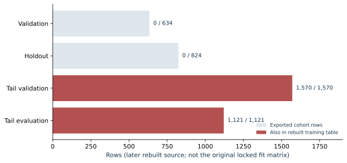

# Empirical evidence and its interpretation

## Three kinds of evidence

The available results belong to three distinct layers. Historical reports and saved predictions describe models developed on the operational dataset. Saved replay and restoration checks assess whether the software reproduced its recorded behavior. New public synthetic experiments test a reproducible comparison pipeline under known data-generating mechanisms. The layers support different claims and should not be combined into a single performance number.

The historical project is substantial: it progressed from temporal feature stores and AFT tail screening to multimodal neural models, stage-specific decisions, calibration, policy selection, and deployed inference. A critical review should acknowledge that progression while examining which final populations were independent of development. The public comparison provides a cleaner experimental scaffold, but its synthetic population does not establish superiority on the historical market data. Aggregate evidence files accompanying this chapter make the numerical distinctions inspectable without releasing private rows.

## Earlier tail screening with structured anchors

The earlier AFT work focused on a slow tail, defined at 504 hours, or 21 days. The saved empirical chapter reports an evaluation cohort of 941 observations, including 166 slow outcomes, and a calibration cohort of 853 observations, including 171 slow outcomes. The confusion matrices are reproduced from the historical figure rather than reconstructed from hypothetical predictions.

Table. Historical slow-tail cohort sizes and confusion counts.

| Population | N | TP | FP | FN | TN |
|---|---:|---:|---:|---:|---:|
| Evaluation | 941 | 143 | 29 | 23 | 746 |
| Calibration | 853 | 162 | 86 | 9 | 596 |

Table. Historical slow-tail prevalence and performance.

| Population | Prevalence | Precision | Recall | F1 |
|---|---:|---:|---:|---:|
| Evaluation | 17.64% | 0.8314 | 0.8614 | 0.8462 |
| Calibration | 20.05% | 0.6532 | 0.9474 | 0.7733 |

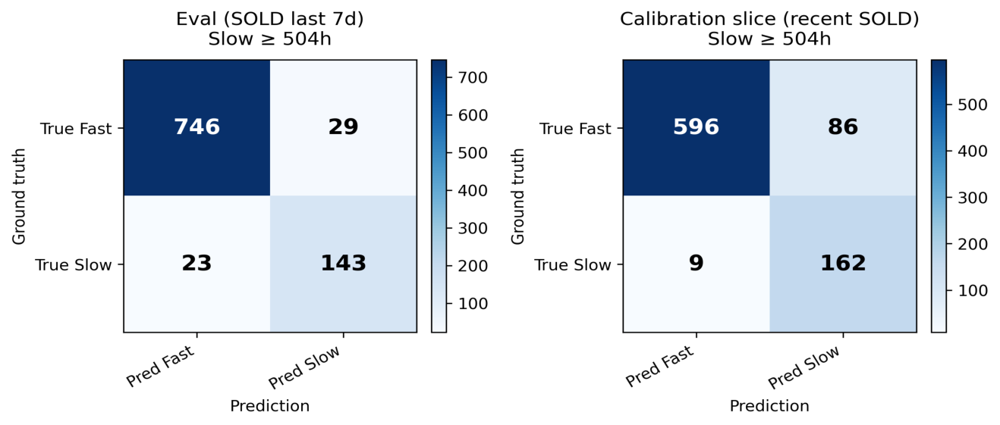

Historical figure H04. The source report's slow-tail confusion matrices use a 504-hour event threshold. The labels refer to the report's own cohorts and should not be confused with the later 72-hour neural-policy populations.

The evaluation precision interval reported in the earlier chapter is approximately 0.7683-0.8800 and the recall interval approximately 0.8007-0.9059. These finite-sample intervals are useful context. They do not account for model-search selection or any repeated consultation of the evaluation cohort. The report describes an optimizer objective using the evaluation F1 of 0.8462; consequently, the strongest safe interpretation is descriptive historical performance, not a claim of an untouched prospective test.

The earlier work also reports a sacrifice measure: how many items from faster duration bands are rejected by slow-tail screening. Evaluation sacrifice was 0.59% for durations below ten days and 26.88% for the middle ten-to-21-day band. Calibration sacrifice was 1.43% and 63.41%, respectively. The large difference in the middle band shows that similar high recall can coexist with very different selection behavior.

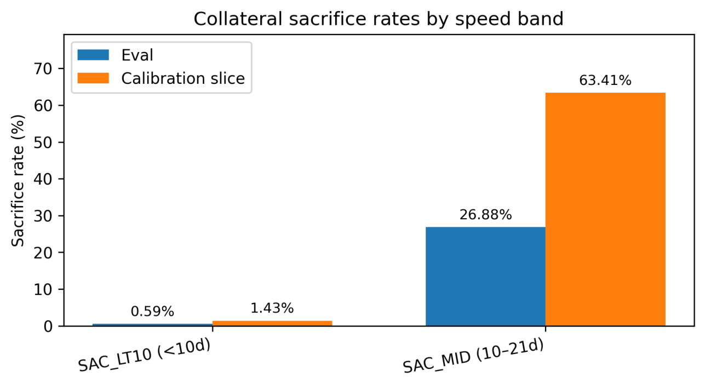

Historical figure H05. Duration-band rejection rates expose a tradeoff hidden by a single F1 score. These rates describe classification behavior; they are not realized financial losses or evidence of profitable interventions.

Anchor variables dominate the historical split-gain ranking: the strict anchor contributes approximately 28.15% and the flexible anchor 25.45%, with the next comparable statistic around 4.15%. This is consistent with the design emphasis on supported price comparisons. Split gain is an attribution within the fitted model and can distribute importance unevenly among correlated variables. It does not establish the causal effect of an anchor or its incremental out-of-sample value without an ablation.

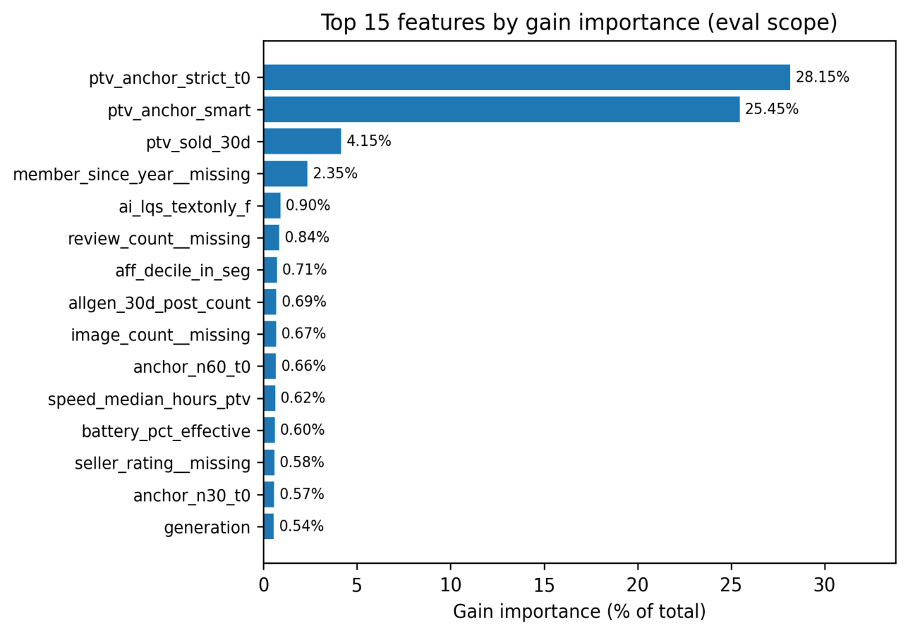

Historical figure H06. Anchor-derived variables carry substantial fitted-model gain in the earlier report. The plot is evidence about that fitted model's use of inputs, not a proof that removing an individual correlated feature would reduce performance by the plotted percentage.

The feature-store paper similarly explores live-stock pressure after stratifying by price. Its plots suggest conditional association in selected groups, with modest information-gain values in the accompanying analysis. These are useful hypotheses for subsequent validation. They should not be interpreted as a completed controlled experiment proving that inventory features improve every model.

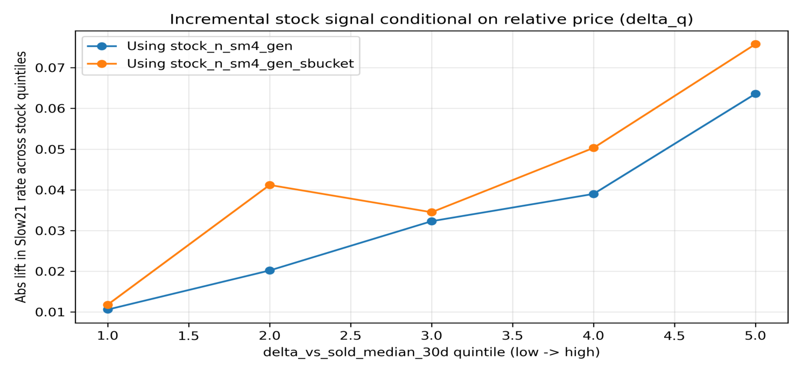

Historical figure H07. The historical stock analysis compares slow-outcome rates across stock strata within price strata. It is an exploratory association plot; uncertainty and an independent incremental-performance comparison cannot be recovered from the image alone.

## Later 72-hour policy results

The later saved policy predictions allow direct recomputation of counts. The selection population contains 584 observations, the broader holdout 748, and a recent event-selected subset 283. The recent subset is nested within the 748-row holdout, with matching decisions. It is therefore useful for temporal characterization but is not an additional independent test that can be added to the holdout denominator.

Table. Saved 72-hour policy cohort sizes and confusion counts.

| Population | N | TP | FP | FN | TN |
|---|---:|---:|---:|---:|---:|
| Selection | 584 | 126 | 14 | 203 | 241 |
| Holdout | 748 | 306 | 93 | 166 | 183 |
| Recent nested subset | 283 | 154 | 27 | 66 | 36 |

Table. Saved 72-hour policy prevalence and performance.

| Population | Prevalence | Precision | Recall | F1 |
|---|---:|---:|---:|---:|
| Selection | 56.34% | 90.00% | 38.30% | 0.5373 |
| Holdout | 63.10% | 76.69% | 64.83% | 0.7026 |
| Recent nested subset | 77.74% | 85.08% | 70.00% | 0.7681 |

These are dedicated-head policy decisions, including the selected policy combination; they are not automatically identical to a threshold on the neural survival curve's $1-S(72)$. The stored scalar head has a persistence-oriented interpretation in the inspected adapter, so conversion to a fast-event score requires its documented complement. Reversing that interpretation would change the meaning of every threshold.

The selection result shows a high-precision, low-recall operating point. The later holdout admits a broader fraction and has lower precision. This is compatible with changed prevalence, shifted feature distributions, imperfect calibration, and selection uncertainty; the aggregate table alone cannot identify the cause. The 56.34%, 63.10%, and 77.74% positive rates describe selected cohorts. They are not estimates of the entire market's turnover rate.

For perspective, an all-positive classifier has F1 approximately 0.7738 on the holdout and 0.8748 on the recent subset. These exceed the reported policy F1 because positive prevalence is high. That does not make the policy useless: an all-positive rule cannot meet a selective high-precision requirement. It does mean that F1 alone is an insufficient argument for the selected policy. Precision, recall, workload or selected fraction, and the user's utility constraints must be reported together.

## Duration-zero sensitivity and target provenance

The holdout contains 178 zero-duration records, all positive for the 72-hour target; the recent subset contains 70. A diagnostic that excludes these records changes holdout precision from 76.69% to 66.30% and recall from 64.83% to 62.24%. On the recent subset, precision changes from 85.08% to 78.91%. The sensitivity is material and should be visible in any empirical interpretation.

This exclusion is not a corrected benchmark. A zero duration can arise from the chosen origin, event timestamp resolution, same-time observations, or a processing rule. It is not automatically a corrupt label. The correct response is to trace how the decision or edited origin and event time were formed, whether negative intervals were clipped, and whether a zero-duration event could have been known at the claimed decision. The saved evidence establishes sensitivity; it does not by itself adjudicate every zero-duration case.

The research protocol should prespecify a treatment of same-time and already-resolved observations, report interval resolution, and distinguish the question of immediate event probability from the question of forecasting unresolved live cases. This avoids a model appearing strong because it predicts records whose outcomes were already effectively settled at the time origin. The detailed leakage chapter examines the available timestamp and overlap evidence without treating missing original exports as proof of either validity or invalidity.

## A reproducible synthetic comparison

The public smoke experiments each generate 1,200 synthetic observations and use a fixed chronological split: 593 training, 267 selection-validation, and 340 test rows. Both use the same prespecified model seed and one candidate configuration per family. One fixture contains nonlinear structure; the second follows a proportional-hazards regime. These experiments exercise all six estimators and the shared censoring, selection, scoring, and artifact-writing paths.

| Model | Nonlinear fixture test IBS | Proportional-hazards fixture test IBS |
|---|---:|---:|
| Kaplan-Meier | 0.242390 | 0.228664 |
| Cox proportional hazards | 0.180544 | 0.177519 |
| Random survival forest | 0.202620 | 0.194749 |
| Gradient-boosted survival analysis | 0.204181 | 0.189392 |
| Multilayer perceptron | 0.193811 | 0.190466 |
| Compact Perceiver mixture | 0.193862 | 0.183155 |

Lower integrated Brier score is better. Exact machine-readable values, selections, and protocols are retained in [the nonlinear aggregate](../../research/examples/synthetic_smoke/summary.json) and [the proportional-hazards aggregate](../../research/examples/synthetic_ph_smoke/summary.json). The comparison uses a common grid from 12 to 120 hours and training-derived censoring weights. It does not tune new configurations after observing the test table.

Cox has the lowest observed IBS in both fixtures. In the nonlinear fixture the two neural models outperform the two tree configurations, but Cox still performs better than either neural model. In the proportional-hazards fixture the compact Perceiver mixture outperforms the two tree configurations, while the dense neural model does not outperform the boosted model. These results directly contradict a blanket claim that either neural models or trees must win.

The paired difference between compact Perceiver and Cox IBS is approximately 0.01332 in the nonlinear fixture, with a 95% bootstrap interval of 0.00104-0.02441. In the proportional-hazards fixture it is approximately 0.00564, with interval −0.00305-0.01450. Positive differences favor Cox. The intervals use 500 paired resamples and are conditional on the fitted models; they are not a population-wide statement about model classes or uncertainty from repeated training.

The main result of these runs is methodological: the benchmark executes, freezes selection, produces comparable survival metrics, and reports an outcome that does not favor its most elaborate architecture. This is a useful property for subsequent real-data work. Synthetic smoke results remain a demonstration of that pipeline, not evidence that the historical operational model beats Cox or trees on genuine future listings.

## What a complete empirical claim still requires

The real comparison needs a versioned decision-time cohort, explicit event provenance, resolved temporal overlap, train-fitted transforms, and a final population that has not influenced feature or policy choices. It also needs enough observed events in each duration region to assess all stages. High-dimensional image counts cannot substitute for event counts, and a successful forward pass cannot substitute for statistical validation.

The most informative next study would combine the established operational evidence with a sealed future evaluation. Its first analysis would compare whole-curve performance and calibration across the six model families. Prespecified ablations would then isolate structured attributes, listing text, pooled visual vectors, and per-image reports. A temporal analysis would compare recent and older training windows while holding the test period fixed. A policy analysis would evaluate selected fraction, precision, recall, and explicitly stated utility, keeping prediction and intervention claims separate.

The current evidence already supports a serious research-and-engineering contribution: a large multimodal data system, multiple survival formulations, real policy artifacts, verified execution parity, and an executable neutral benchmark. Its principal unresolved empirical question is the size and stability of the neural model's advantage, if any, under a matched prospective comparison. Presenting that question precisely strengthens the work because it makes the next result interpretable whichever estimator succeeds.


# Operational engineering as a condition for reproducible research

## What was actually operated

The project is not merely a collection of model notebooks. Its retained artifacts show a coordinated platform for repeated data observation, structured interpretation, feature construction, vectorization, model inference, policy explanation, and recovery. The operator reports approximately 70,000 successful automation runs across the platform's lifetime. That is a platform-wide historical account. A separately inspected metadata snapshot preserves 15,360 workflow runs from 40 distinct workflows; this narrower retained population neither independently establishes nor contradicts the larger lifetime count.

The distinction between retained evidence and reported lifetime experience is essential. Systems migrate, histories are pruned, and backup dates can be later than the last retained execution. A retrospective reviewer should count the records that exist, state their scope, and avoid converting an incomplete retained database into a claim that earlier operation did not happen. The evidence is sufficient to establish sustained, multi-component operation while keeping the 70,000-run total explicitly attributed.

The retained scheduler history spans execution timestamps from September 16, 2025, at 23:30 UTC through March 31, 2026, at 07:03:18 UTC. Its snapshot was retained on April 29, 2026. It contains 15,254 successful, 103 failed, two running, and one queued workflow states, with no duplicate primary-key rows in the audited extraction. Among 15,357 terminal states, the stored success fraction is 99.3293%. This is a final-state workflow statistic, not an uptime measurement, an independent first-attempt success rate, or a guarantee that every successful workflow produced semantically correct data.

One retained survival-inference workflow contributes 262 successes and three failures. Those counts establish that inference was part of recurring operation. They are not the total number of predictions, the number of model training experiments, or the total number of stage-specific jobs. A single workflow may process a batch; another may perform maintenance. Workflow runs, task instances, scored rows, and listing observations should never be summed as though they were the same unit.

## The retained data scale and its denominators

The audited April 28 metadata bundle describes a database of 29,106,213,679 bytes, approximately 29.11 decimal gigabytes. Its principal relation counts are summarized below. The public [operational evidence record](../../research/thesis_evidence/operational_counts.json) preserves the unit definitions and audit-receipt hashes.

| Retained object | Count | Interpretation |
|---|---:|---|
| Listing records | 55,260 | Stored rows, not an independently deduplicated lifetime entity population |
| Image assets | 240,622 | Multiple assets may belong to one listing |
| Image-feature records | 228,958 | Machine-derived feature records, potentially versioned |
| Structured text-enrichment records | 54,841 | Derived interpretations, not raw text tokens |
| Text-vector records | 62,244 | 768-dimensional records with their own coverage and versions |
| Image-vector records | 80,688 | 512-dimensional records, not one vector for every stored image |
| Post-event audit records | 34,307 | Later-stage audit evidence requiring a separate temporal boundary |

These denominators matter scientifically. The vector count can exceed the listing count because source coverage and versions differ. The image-feature count is not a number of independently labeled survival outcomes. The post-event audit count is evidence of a repair and reconciliation workload, not permission to use those records as initial-time predictors. Treating the database as one flat number of samples would overstate both training independence and temporal admissibility.

The system's scale also explains why operational design is part of the research contribution. Hundreds of thousands of visual records require stable identity, repeatable transforms, resource limits, failure isolation, and selective reprocessing. Without these controls, a model comparison would conflate architecture changes with changing or partially processed inputs. The platform makes it possible to ask a stable scientific question over heterogeneous evidence.

## Scheduling, readiness, and partial progress

The historical architecture uses scheduled workflows and specialized workers with explicit responsibilities. Text interpretation, image interpretation, vector construction, feature refresh, and survival inference can advance at different rates. A listing may be known to the platform before it has enough image or text evidence for the intended model. Readiness therefore needs its own state rather than being inferred from the listing's existence.

The inspected serving design reports eligible, blocked, and ready populations, including missing text, image, and image-slot evidence. Work is leased in bounded batches and scored outputs retain their execution time and version. A model result created after a substantial delay remains a result at that later decision time; its existence should not be backdated to the first observation. This makes latency an information-availability issue as well as a service-performance issue.

Failure isolation supports continuous progress. A malformed image response can leave a particular item incomplete while other items continue. A connection retry can recover a transient database failure without marking every item done. A content hash can prevent redundant vector recomputation. These mechanisms explain how a complex pipeline can operate repeatedly rather than requiring a human to restart a monolithic experiment after every local error.

There are limits to what a success state proves. A task may finish with partial coverage under an explicitly allowed policy. A cache may serve an older but valid artifact. A semantic mistake can pass a syntactic validator. Meaningful operational metrics therefore include readiness, stale-output age, failed-item counts, retry counts, and evidence completeness in addition to top-level workflow state. The retained run statistics show operational maturity, while these additional measures define the next level of observability.

## Replaying the model rather than only preserving its weights

Neural deployment requires a bundle, not just a checkpoint. The bundle includes the architecture, fitted preprocessing, feature names and order, category vocabulary, vector revisions, masks, output interpretation, calibration, policy thresholds, and reference inputs and outputs. Any one of these can change a decision while the checkpoint file remains identical. The historical serving work recognized this and preserved explicit replay fixtures and manifests.

A saved 523-row contract comparison from an older model generation checked expected and served identities, 12 seed or meta decision and bucket columns, and 91 numeric columns. The maximum meta-probability difference was approximately $1.01\times10^{-7}$, and the maximum point-estimate difference was approximately $9.16\times10^{-5}$ hours. Two separately captured 32-row live replays agreed exactly across 90 numeric columns. These are strong results for implementation parity within their stated artifacts and tolerances.

Parity has a precise scope. It establishes that two execution paths compute the same function on the checked inputs. It cannot establish that the function is well calibrated, that the labels are correct, or that its inputs were historically available. The older proof package also recorded a not-ready-for-live-forward status at creation. That status should not be silently promoted into certification of a later policy or current deployment. The research value lies in preserving and checking the evidence, including its release status.

One bounded archived inference run leased and scored eight rows with no failures. Its recorded stage duration was approximately 0.838 seconds, including roughly 0.773 seconds in forward computation. The vectors were already available. This supports the feasibility of a warm batch execution path, not a cold-start latency claim or a percentile service-level objective. Latency evaluation should separately measure evidence preparation, queue delay, model loading, forward computation, and publication of a usable decision.

## Explanations are a separately tested product

The platform also translates structured predictions and evidence into user-facing explanations. This layer has its own correctness risks: reversing a score's meaning, describing hidden damage as observed, treating an absent image as evidence of good condition, or presenting a stored prediction as fresh. Explanation tests must therefore validate evidence use and output semantics, not merely punctuation.

The saved narrative contract suite contains 70 passing tests. A separate representation-parity check compared two deterministic narrative implementations on 5,000 sampled rows from 6,049 eligible records and found zero mismatches. These results concern explanation logic and formatting. They must not be relabeled as 5,000 neural-model accuracy checks or 70 successful training experiments. Keeping the scopes separate makes both accomplishments more credible.

The implementation spans more than one language and service. Narrative calculation and wrappers should be attributed to their actual components; the presence of a compiled agent service does not make all explanatory logic part of that service. The later agentic-decisions chapter describes the real service boundary, controlled analytical access, cached context, streamed responses, and decision workflow. The operational point here is that a trustworthy explanation is an independent, testable interface between a probabilistic model and a human decision.

## Recovery and integrity of research artifacts

Recovery evidence is unusually concrete. Six saved restoration reports declare successful checks. The most recent, dated April 25, compares 10,230 files by hash and checks counts for 23 critical relations and eight data profiles, with exact matches on the declared checks. This is materially stronger evidence than the mere existence of backup files: it shows that retained copies were restored and compared against specified expectations.

The checks are still scoped. File equality does not prove application correctness, and matching relation counts do not detect every possible row-level difference. The hash comparisons and data profiles strengthen that evidence, but they do not imply every table and every operational dependency was tested. The publication reports the historical saved checks; it does not claim that a new restoration was performed during the review.

Recovery matters for research because feature and model artifacts can otherwise become irreproducible after an incident. A complete experiment may depend on a particular canonical text revision, encoder artifact, fitted scaler, slot manifest, model checkpoint, policy file, and prediction export. If only the database or only the weights are retained, the result may not be reconstructable. The architecture's backup and manifest work addresses that systems-level reproducibility problem.

The distinction between source code recovery and faithful historical reconstruction also deserves attention. Some retained components are reconstructed from a documented production contract because an original internal body was unavailable. Such a component may reproduce the documented interface without proving exact bitwise identity with the lost implementation. A publication should preserve that provenance rather than labeling every recovered file as the original execution source.

## Adaptation in a rapidly changing market

The operator observes that recent data, particularly roughly the latest two months, is especially important in this market. The project contains corresponding mechanisms: recent comparable windows, feature refresh, incremental representation updates, changed-input rescoring, model retraining, and stage-specific recency parameters in the tuning material. The historical anchor documentation includes thirty- and sixty-day windows. The stage-tuning documentation exposes recency half-life settings, including a search range of five to 35 days in one procedure. Inspected selected configurations use 30 days for Stage 0 members and 23 days for Stage 1.

These observations support the need to study temporal adaptation. They do not establish that a fixed 60-day window is universally optimal. A short window reduces staleness but also removes rare examples and tail events. A long window improves support but can average over a changed price regime, item mix, or observation process. Exponential weighting offers an intermediate option,

$$
w_i=2^{-\Delta_i/H},
$$

where $\Delta_i$ is age relative to the chosen reference date and $H$ is a half-life. The inspected trainer mean-normalizes these weights before using them. Thus a 30-day half-life downweights a 60-day-old observation to one quarter of an otherwise equivalent newest observation before common normalization; it does not discard every observation older than 60 days. The exact production weight remains tied to the selected training configuration and its reference date. The model chapter gives the implementation-level trace.

A controlled recency experiment fixes a future test period and compares training windows or weights selected on an earlier validation period. It reports not only mean error but event support in each stage, calibration drift, and readiness changes. The observed positive-prevalence shift from 56.34% to 63.10% to 77.74% across selected historical populations motivates such an analysis, but selection and nested cohorts prevent interpreting it as a direct estimate of market-wide acceleration.

Operational adaptation is therefore a sequence of versioned decisions. A refresh changes inputs; a recalibration changes probability interpretation; a new threshold changes action selection; a retraining changes the predictive function. Each has a different validation burden. The retained platform supplies much of the infrastructure needed to implement those changes safely. Evidence of autonomous online learning or measured improvement after every refresh is not required to recognize that substantial engineering, and is not claimed here.

## Engineering quality and scientific value

The most persuasive operational strengths are concrete: repeated workflow execution, large multimodal stores, owned field contracts, explicit readiness, numerical replay, explanation parity, and verified restoration. The main maintenance burden is also recognizable: many independently versioned components, recovered historical variants, cross-language interfaces, and complex lifecycle-dependent feature availability. These are the kinds of dependencies emphasized in the systems literature on machine-learning technical debt. [Sculley et al., 2015](https://proceedings.neurips.cc/paper/2015/hash/86df7dcfd896fcaf2674f757a2463eba-Abstract.html).

The appropriate assessment is consequently neither a toy prototype nor a proof of flawless production behavior. It is a substantial operational research platform whose engineering made the modeling program possible. Its next scientific advance depends on using that capability to preserve a sealed sequence of decision-time predictions and outcomes. Its next engineering advance depends on making contracts, ownership, provenance, and release gates easier to inspect as the number of model and evidence versions grows.


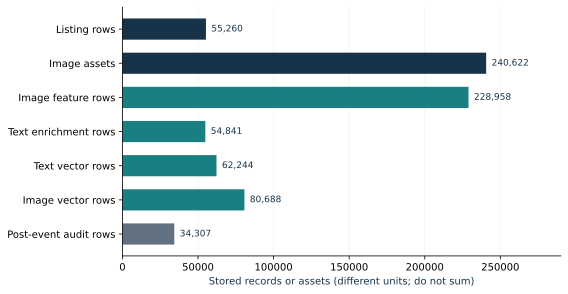

# Discussion, limitations, and a program of decisive experiments

## The contribution is a connected system of research claims

The work combines survival modeling with a temporal multimodal measurement platform. Its contribution should be assessed at several connected levels: a representation of censored market duration; supported price and inventory features; structured interpretation of images and text; a neural cascade with stage-specific objectives; reproducible serving; and a controlled framework for comparing model families. None of these alone is wholly unprecedented. Their integration addresses the practical difficulty of making a prediction from heterogeneous evidence that arrives over time.

A useful novelty statement therefore focuses on the relationship between components. The system does not merely concatenate embeddings with a table. It manages field ownership, image roles, evidence quality, temporal readiness, historical comparison support, stage routing, policy outputs, and operational recovery. These controls make it possible to ask whether a multimodal model improves an actionable time-to-event prediction under a defined information set. The scientific claim concerns that structured experiment, not an assertion that attention, mixtures, AFT, or hierarchical shrinkage were invented here.

The project also illustrates a productive interaction between engineering incidents and research design. A visually induced identity correction led to a conflict-aware guard. Outcome-dependent missingness led to a revised feature boundary. Numerical serving comparisons led to explicit bundle contracts. Such fixes do not erase the earlier failure modes; they document how the system became more measurable. A mature account records both the discovery and the residual proof obligation.

## Fast movement makes time origin a substantive choice

In a rapidly changing market, a prediction can become stale before its nominal forecast horizon ends. Price changes, competitor arrivals, new photographs, and elapsed unsold time change the decision context. The same item can therefore warrant different predictions at first observation and several days later. Treating these as interchangeable rows hides the actual forecasting question.

The age-conditional survival expression $S(a+u)/S(a)$ formalizes one part of that update: an item that remains unresolved at age $a$ belongs to a selected survivor population. Newly arrived evidence may require a richer time-varying model or a new landmark decision, rather than merely substituting current features into an old initial-time model. The distinction is practically relevant to the cascade because each stage emphasizes a different duration region and decision tradeoff.

The operator's emphasis on recent observations is plausible in this setting. Older examples can be less representative of prices and demand, while still providing essential support for rare conditions and slow outcomes. The optimal balance is empirical. A result from a single historical window cannot establish a universal decay constant. Rolling, sealed evaluations are needed to determine whether recency weighting improves performance, how much effective sample size it removes, and whether its benefit differs between the fast and slow stages.

The temporal platform is thus more than a leakage defense. It is the infrastructure for studying change. Recorded evidence times and model versions allow researchers to distinguish a model that became stale from a feature pipeline that became slower, a change in event prevalence from a change in label availability, and genuine adaptation from repeated tuning on a familiar cohort.

## What can be concluded about model performance

The historical results establish that the platform produced nontrivial predictive policies and that their selected operating points can be reconstructed. The early slow-tail classifier achieved strong descriptive precision and recall on its reported population. The later 72-hour policy demonstrated selective high precision during tuning and different precision-recall behavior on subsequent saved populations. These are meaningful empirical artifacts, with cohort and selection limitations that must accompany them.

The results do not establish that the neural system is generally superior to Cox, random survival forests, or boosted survival models. That comparison was not completed on a single sealed real-data cohort with a common information contract. The public synthetic experiment is deliberately informative here: Cox has the best observed integrated Brier score in both fixtures. The more elaborate network cannot claim a win simply because it can represent nonlinear multimodal interactions.

There are several scientifically interesting possible outcomes of a matched comparison. Neural fusion may win because per-image evidence matters. A strong tree may match it because engineered anchors already explain most predictable variation. Cox may remain competitive because event support is limited relative to model flexibility. A simple model may win overall while a neural model improves a prespecified subgroup. Each outcome would refine the understanding of the problem if assessed under the same protocol and reported without selective emphasis.

## Measurement error and generated evidence

The enrichment layer makes important condition information computable, but it also introduces model-generated measurement error. A concise canonical report can help normalize observations while discarding ambiguity. A confidence value can encourage overinterpretation if it is mistaken for calibrated reliability. A visually persuasive example can conceal the fact that unreadable or contradictory cases are more difficult.

The required response is a measured enrichment evaluation. A stratified annotation study should distinguish visible facts, seller assertions, unobservable attributes, and ambiguous cases. It should report disagreement between human reviewers and the machine, abstention rates, and error severity. Evaluation should include ordinary random cases and targeted stress cases, with the two sampling strategies analyzed separately. This would quantify the meaning of AI-assisted observation rather than infer accuracy from operational completion.

The downstream model adds another layer. An attribute can be measured accurately and still contribute little to survival prediction. Conversely, an inaccurate attribute can appear predictive through a correlation with the enrichment process. The matched ablation therefore needs both temporal controls and measurement diagnostics. Generated reports and their source images should be recognized as dependent evidence, not counted as independent modalities merely because they occupy separate tensor branches.

## Censoring, selection, and unresolved target questions

An observed terminal status is not necessarily a verified transaction, and a stored event time may reflect observation resolution. This matters for both economic interpretation and duration-zero records. The analysis should identify the event actually measured and separate it from the business interpretation attached to it. A censoring model cannot repair a mislabeled event definition.

Selection by observed event date also changes the population. It excludes unresolved observations and can overrepresent faster items near the end of a window. The recent 283-row subset is nested in a broader saved holdout and is event-selected; it is useful for a bounded diagnostic, not a new independent future cohort. The original feature exports and split manifests are needed to settle which historical overlap concerns apply to the exact selected model versions.

Inverse-probability censoring adjustment introduces its own assumptions. A common marginal censoring estimator is straightforward and supports reproducible scoring, but observation loss may depend on covariates or lifecycle state. Sensitivity analyses should examine weighting support, alternative horizons, and informative loss mechanisms. An evaluation can be exact relative to its formula while still relying on assumptions that deserve separate scrutiny.

## Economic actions require more than observational prediction

The platform's decision interface connects duration forecasts to candidate selection, offer ceilings, and workflow stages. This is a meaningful operational application, but an observational survival model does not identify the effect of changing an offer or price. An attractive item can sell quickly for reasons absent from the data, and the seller's pricing choice can itself respond to those reasons.

A causal intervention claim requires a design that identifies the counterfactual outcome under the proposed action. A randomized or carefully designed sequential experiment would be stronger than retrospective simulation alone. Until then, the model can support prioritization and scenario discussion under explicit assumptions, while realized utility is monitored separately. The agentic-decision chapter distinguishes the actual implemented controls from the broader decision-theoretic framework.

Operational costs also belong in that evaluation. Image interpretation, vector construction, inference latency, and human review consume resources. The current evidence documents resource-aware decomposition and reuse, but not a complete controlled cost study. A useful next protocol would measure cost per newly ready decision and per reviewed candidate, together with predictive gain and failure rate. This avoids calling a complex system efficient solely because one warm forward pass is fast.

## A sequence of decisive experiments

The first priority is a sealed cohort with immutable evidence references, explicit decision times, and event provenance. Predictions should be written before outcomes mature and should include the model, transform, policy, and readiness versions. No architecture or threshold should change in response to that cohort's outcomes until the evaluation is closed. The existing platform is well placed to support this because it already records much of the necessary operational state.

The second priority is a matched estimator comparison using the six-family ladder and common temporal preprocessing. The primary result should be a whole-curve proper scoring rule on a prespecified supported horizon, supplemented by calibration, ranking, and decision metrics. The principal neural-versus-Cox and neural-versus-tree comparisons should be declared in advance, with seed and temporal variability reported.

The third priority is a representation study. Structured-only, text, pooled visual, and per-image report branches should be added in a controlled sequence. A verified ordinary-versus-whitened representation experiment belongs here once the exact fitted transforms are preserved. A transform's training population is part of its provenance; future data should not be used to estimate its covariance before final testing.

The fourth priority is an adaptation study. It should compare recent windows, exponential decay, calibration updates, and full retraining over successive future periods. The experiment should distinguish a genuinely changed market relationship from a change in evidence readiness or observation policy. The result can then justify a refresh cadence and recency setting rather than simply reflecting operator intuition.

Finally, a measurement-and-decision study should connect enrichment accuracy to selected actions and resource use. It can determine whether more expensive visual interpretation materially changes decisions, whether uncertainty-aware abstention helps, and where human review provides the greatest value. This is the path from a capable research platform to an evidence-based operational policy.

## Overall assessment

The retained work is technically advanced applied research and systems engineering. Its depth comes from the combination of temporal feature governance, multimodal measurement, censored-outcome modeling, stage-specific policies, operational automation, numerical replay, and restoration evidence. The reported lifetime volume and independently audited retained run history are consistent with a platform that was operated extensively, not merely demonstrated once.

# The implemented agentic decision system

## From a forecast to an operational workflow

The platform included an implemented operator system for candidate review, message drafting, approval, conversation mirroring and outcome follow-up. It was more than a proposal to connect a language model to a database. The inspected source contains a typed action-proposal schema, a context-packet builder, a model-call runtime, a deterministic proposal validator, persistent action and execution records, a stateful execution service, a Rust cache and realtime layer, and operator interfaces. The historical documentation records a known operational baseline and subsequent read-path verification.

These facts establish the existence and structure of a working decision-support and execution architecture. They do not establish an independently profitable autonomous trading strategy. The implementation deliberately distinguishes a proposed action, a staged draft, an approved send, an uncertain send, an observed reply and an applied outcome. This distinction is a strength of the design: the system does not have to pretend that model-generated prose is execution evidence.

The role of the survival model is to add information about time and liquidity to a broader decision packet. A listing that may disappear quickly can justify prompt review; a long-tail estimate may justify waiting, lowering priority or demanding a greater margin of safety. The forecast does not establish the item's condition, the seller's reliability, the realized resale price or the causal effect of an offer. Those require separate evidence and models.

## The implemented division of responsibilities

The inspected conversation-agent runtime has four principal layers. A web interface displays candidate and conversation state. A cockpit API proxies the operator-facing endpoints. A Python execution service manages authenticated interaction, thread reconciliation, composers, drafts and send flows. A Rust service provides caching, serialized refresh work, server-sent events and latency instrumentation. The authenticated session is stateful infrastructure; it cannot be treated as a disposable stateless request worker without changing execution behavior.

The Rust layer's contribution is operational coordination. Its source includes per-run locks, conversation caches, queued background refreshes, queue status, event streams, bounded latency samples and correlation identifiers. These mechanisms reduce duplicate concurrent work and let the interface update while retaining durable state elsewhere. Rust is not the language of every model or every narrative rule in the system. The project combines Python, SQL, TypeScript and Rust according to responsibility; describing all reasoning as a Rust model would misrepresent the inspected architecture.

A separate Rust language-model service supports analytical questions over curated documentation and approved database views. It loads a document manifest, selects relevant documentation, authenticates users, stores conversations, reserves request quota, requests a structured response and validates generated SQL before execution. This analytical service and the conversation execution service are different control paths. Access to analytical data does not itself grant permission to send a message or commit funds.

## Context packets as an explicit information contract

The implemented context builder packages the listing, deal-engine fields, evidence, thread state, session readiness and policy. It includes the current ask, recommended opening offer, maximum buy ceiling, fast and standard resale floors, route and lane explanations, condition and damage fields, a bounded description excerpt, recent messages and operational readiness. Compact, standard and expanded modes limit description length to 500, 1,200 and 2,500 characters respectively. The message count is bounded between zero and fifty, with twelve as the default.

Those limits are a concrete form of context engineering. The language model receives selected structured evidence rather than the entire database or an unbounded conversation history. The package also declares the distinction between proposal, executor and browser lanes. The browser is not exposed as an actuator to the proposal model. The model is instructed to use the supplied economic fields and return exactly one action proposal.

The inspected context does not by itself prove that a survival curve is present in every agent prompt. Some downstream fields can reflect model-derived ranking or candidate selection, but the visible packet must be audited separately from upstream data availability. A stronger survival-aware extension would include the model version, forecast origin, scoring time, horizon probabilities, uncertainty and freshness explicitly. That is an extension of an existing packet architecture, not evidence that every component was already connected in the retained version.

The context builder also identifies conditions that block or restrict actions, including incompatible seller scope, bidding-style listings, unavailable listings without a known thread, and session readiness. Buy-offer drafting is included among allowed actions only when the opening offer and ceiling are present. Survey campaigns use a different message-only policy. A downstream executor must still enforce these restrictions at action time because readiness and listing state can change after the packet was built.

## Structured proposals and deterministic checks

The action schema admits five proposal types: wait, stage a draft, refresh the thread, mark the case for review, and apply a candidate reported outcome price. Supported objectives cover next-action advice for an outcome survey, buy-offer advice and thread-reply advice. A proposal contains an action, campaign, optional message and offer, a short rationale, evidence references, confidence and an optional candidate outcome price.

The inspected model runtime requests JSON output with a low temperature of 0.15, parses the returned JSON, and validates it against the typed schema. This reduces formatting variability and narrows the action space. It does not make language-model reasoning deterministic, certify the truth of a rationale, or calibrate the supplied confidence. The model's own confidence is a bounded numeric field, not a validated probability of a successful trade.

The policy validator checks that the objective and action are supported, that the action is allowed by the packet, that the campaign matches, and that evidence references are present. It checks message-language constraints and blocks direct-send instructions in generated message content. Draft actions require message text. A message-only campaign cannot contain an offer field or detected offer language. A buy-offer draft requires an offer value, and a supplied offer is compared with the supplied ceiling. Confidence must fall between zero and one.

These are implemented checks, not a proof of complete safety. In the inspected validator, evidence references are required to be nonempty but are not resolved there into verified source claims. The ceiling comparison is conditional on both numeric values being present; the context builder's buy-offer eligibility rule is therefore part of the end-to-end contract. The validator's action allowlist and the packet's separate blocked-action descriptions are also distinct fields. A complete assurance case must test the composed path, including the executor, rather than assume a check in one layer enforces every statement in another.

The distinction between schema validity and semantic validity is the same distinction encountered in image enrichment. A well-formed proposal can still misunderstand a photograph, misread a seller's statement, rely on stale prices or cite an irrelevant field. Deterministic checks bound the proposal; they do not eliminate the need for evidence evaluation and outcome measurement.

## Execution, persistence and operational truth

The system stores candidate staging, runs, run events, mirrored thread state, context packets, action intents and execution batches. The inspected database definitions include batch items, item-level events, candidate sets, session state and session events. The data model can therefore distinguish a cohort of proposed actions from individual execution outcomes. Persisted state is materially more informative than a single transient model response.

The context contract states that live sending requires an existing run awaiting approval, a ready session and authentication state, a fresh heartbeat, operator approval outside the proposal controls, and duplicate or uncertain-send checks. Execution proof events distinguish a staged draft, a clicked send, a completed run, an uncertain send, a reply and an applied outcome. A narrative may claim that an action occurred only when a result packet or event supports it.

This contract matters for retries. A timeout after a send attempt does not prove that the external action failed. Retrying without reconciling the conversation can duplicate a message. Conversely, recording a successful local click does not prove the remote recipient received it. The implementation's uncertain state is a useful representation of this ambiguity. A future unattended workflow would need the same discipline for offers, purchases, cancellations and funds, with idempotency and reconciliation applied to each irreversible step.

The historical read-path documentation records a test in which five unread conversations were opened through the passive read path and the externally reported unread counts remained unchanged. This supports the behavior for those tested conversations and that interface version. It is not an immutable guarantee about future external behavior. The broader known-good baseline records exact manual-draft preservation, conversation refresh, inbox mirroring and operator handoff from a live candidate into a real draft run.

## Evidence-aware listing narratives

The narrative layer turns structured facts into explanations suitable for review. Retained regression results dated 21 April 2026 report seventy passing tests. Their cases include receipt claims versus visual proof, repair history versus current damage, functional fault wording, screen-protector-only damage, stock photographs, packaging claims, missing battery evidence, unsupported damage location and local-market conflicts. These tests show that the implementation encoded distinctions that a generic fluent summary could easily erase.

A separate retained report dated 19 April 2026 compared five thousand sampled live listing narratives from 6,049 eligible rows and reported zero mismatches between the compared implementations. The sample included variation in condition, image damage, text severity, photographic quality and image source. That is strong evidence of agreement within the tested path. Two implementations can agree on the same wrong rule, so parity must not be reported as a five-thousand-example accuracy study against independently labeled truth.

The research significance lies in the separation of evidence roles. A seller's text claim, an image-derived observation, a model forecast and a deterministic business rule should remain distinguishable in the explanation. When evidence conflicts, the narrative should expose the conflict or request review. It should not silently choose the most favorable story. This approach gives a human or a frontier reasoning model a better basis for action than an unqualified score alone.

## Analytical access and its limits

The Rust analytical service parses proposed SQL into a syntax tree, requires exactly one query statement, collects referenced table names through supported query shapes and compares them with an allowlist. Execution applies a statement timeout, wraps the query with a result limit and rolls back the transaction. These are concrete resource and access controls in the inspected code.

The implementation should not be described as a formally proven SQL sandbox. The inspected transaction creation does not itself set a database read-only transaction mode. Its table traversal focuses on supported FROM, JOIN, derived-table and set-operation structures; a comprehensive security claim would require adversarial tests of expression subqueries, functions, database privileges and all accepted syntax. The defensible present statement is that the system implements a restricted analytical query path with several guards. Database-level read-only permissions and complete syntax validation would strengthen that boundary.

This is relevant to the research rather than an unrelated security checklist. An agent that can reason over industry data must receive controlled, correctly interpreted evidence. Analytical access should remain separate from action authority. A plausible SQL answer is not permission to mutate data, message a seller or buy an item.

## How survival information can strengthen the existing agent

Survival estimates add a time dimension that a static bargain score lacks. For a newly eligible listing, a calibrated short-horizon event probability can rank review urgency. A long-tail estimate can identify candidates for patient negotiation or further inspection. A full survival curve can express differences between short-term availability and longer-term persistence that a single binary score conceals.

For an older listing that remains active, the relevant future probability is conditional on survival to its current age. Under a compatible fixed-origin model, the probability of an event over the next interval of length $h$ is

$$
P(a<T\leq a+h\mid T>a,X)=1-\frac{S(a+h\mid X)}{S(a\mid X)},
$$

when the denominator is positive and the conditioning information remains appropriate. If listing content, price or market state has changed, a landmark model using current admissible features may be preferable. Reusing an unconditional historical FAST72 score as a fresh next-72-hour forecast would give the agent a misleading clock.

The frontier-model extension can therefore be described concretely: use the existing context packet, add versioned and time-qualified survival evidence, request a bounded proposal, validate it against deterministic policy, and reconcile execution through the existing event ledger. The reasoning model can explain tradeoffs and ask for missing evidence; the policy layer defines action limits. A model-generated explanation cannot override a stale-feature rejection or invent a buy ceiling.

Economic value remains a separate target. A rapidly disappearing listing may be desirable, mispriced, withdrawn or otherwise unobservable; it is not automatically profitable inventory. An evaluation must measure realized acquisition cost, fees, repair and handling costs, resale outcomes, capital duration and unsuccessful attempts. It must compare policies prospectively or through a defensible off-policy design, not infer profits from survival discrimination alone.

## What scaling would mean scientifically

The platform already supplied data volume, enrichment, candidate generation, typed proposals and tracked execution. Scaling this into a more autonomous system is therefore an engineering extension of implemented components. The missing evidence is not whether an agent interface can be imagined; it is whether the composed policy remains reliable, calibrated and economically useful as volume and market conditions change.

A rigorous next experiment would start with shadow decisions on a frozen policy, record the proposals and the information available at each moment, and compare them with later observable outcomes. Any staged expansion of action authority should have explicit exposure limits, reconciliation tests and stopping criteria. The experimental report should distinguish analytical throughput, accepted proposals, actually executed actions, completed transactions and realized net outcomes. Combining those counts into a single success rate would hide where the system succeeds or fails.

The implemented architecture is powerful because it connects evidence, prediction, explanation and action through inspectable contracts. Its research value is strongest when those contracts retain uncertainty and failure states. The appropriate claim is an operational foundation for data-informed agentic decisions, with identifiable components and testable extensions, rather than an unmeasured assertion of autonomous trading superiority.


# Reusing multimodal representations for spam and fraud assessment

## What the existing system establishes

The feature engineering and neural architecture provide a plausible foundation for a separate spam or fraud assessment task. They combine structured attributes, text, images, image reports and historical context while retaining masks and evidence provenance. Those capabilities can help identify inconsistent content, alternative parses, unusual combinations and records outside a target population. They do not establish that the survival network already detects fraud, or that a fast-event probability is a probability of misconduct. The inspected artifacts contain implemented quality and eligibility controls; this release does not contain a validated operational supervised fraud classifier.

The distinction is documented in [the evidence map](../../research/thesis_evidence/fraud_spam_evidence.json), which records inspected public source paths and hashes and separately identifies private implementation evidence by hash. A label called `spam` in an operational database can cover buying requests, unrelated products, unsupported categories, duplicate interpretations and multi-item bundles. Many such records are legitimate advertisements that do not belong in a particular single-item survival cohort. Reusing those flags as fraud labels would silently redefine an engineering eligibility decision as an accusation about intent.

A defensible extension therefore begins by specifying the new task. Detecting an out-of-scope record, finding a contradiction requiring review, and predicting an independently adjudicated fraudulent transaction are different objectives. They require different labels, operating policies and evidence. The engineering can be shared where justified, but the conclusions must remain separate. This chapter describes both the controls already present and the additional work required for a supervised risk model, without assigning misconduct labels to any identifiable person or account.

## Existing quality controls and their actual semantics

The public duplicate-resolution implementation operates on alternative parsed rows for the same entity identifier. It obtains current textual evidence, requests a structured model decision, applies a deterministic preference for a newer internally consistent row, and marks non-kept interpretations. A bundle claim requires explicit multi-device wording; mere co-mention is insufficient. The code also preserves processing-version information and appends audit evidence. This is substantive reconciliation logic, but it is not a demonstrated cross-account campaign detector. Multiple representations of one advertisement are not equivalent to maliciously repeated advertisements.

The quality-control path classifies record type and scope and can propose canonical-field corrections. In the inspected current private implementation, policy evaluation produces PASS, BLOCK or REVIEW decisions for particular correction conditions. Invalid or inconsistent proposed storage changes are blocked, and changes requiring review are logged rather than automatically applied. The retained public implementation is an earlier generic reference; its presence alone does not prove that every current policy branch or historical run is reproduced. The relevant lesson is the separation between a language model's proposal and deterministic permission to change a canonical field.

Structured enrichment supplies another reusable component. The public normalizer filters emitted codes by confidence, requires a referenced evidence span, and checks that its offsets fall inside the input length. It applies confidence thresholds to structured values as well. These checks constrain malformed or unsupported output, but the inspected normalizer does not itself establish that every quoted string exactly matches the referenced substring or that the model's confidence is calibrated. Evidence-shaped output is not automatically verified evidence. A fraud extension should test quote identity, source version and the semantic support for a claimed contradiction.

The image/text fusion SQL keeps image-quality and stock-photo information, counts usable observations, computes battery-value spread, distinguishes image-only from text-only evidence, and combines damage signals under explicit rules. These fields can expose disagreements between descriptions and visible evidence. They do not prove deception: a stock image, poor lighting, a stale description, a legitimate repair or an ambiguous photograph can produce the same pattern. The appropriate immediate conclusion is that evidence is incomplete or inconsistent, with a reviewable reason, rather than that an actor is fraudulent.

## Contamination is not a single statistical target

The existing code uses the word contamination in more than one way. In survival-policy reporting it is implemented as one minus precision for the fast-event endpoint. A selected row that resolves slowly is a false positive for that endpoint; it is not thereby spam or fraud. Separately, a retrospective bundle audit examines whether single-item economic comparisons were distorted by multi-item content, identity conflicts or unusual realized price relationships. Those checks concern comparability of records and replay outcomes.

The retrospective audit illustrates an important information boundary. Some of its inputs are available in the original title or description, while others depend on realized event or price information. The latter may be useful for auditing a completed evaluation, but cannot be copied into a model intended to warn before an event. A feature dictionary for fraud must distinguish early evidence, later review evidence and final outcome evidence. Simply reusing a column because an existing SQL audit found it useful would risk moving the answer into the predictor.

The same distinction applies to operational exclusions. A multi-item bundle may be unsuitable for a single-item price anchor but entirely legitimate. A buying request may be unsuitable for a sale-duration model but valid content in another product. An unresolved text/image inconsistency may indicate an extraction error. The proposed label schema should therefore retain separate categories for eligibility, representation errors, bundles, unresolved inconsistencies, pending review and independently adjudicated fraud. Collapsing them into one binary label can produce apparently strong metrics while answering an incoherent question.

## A shared representation with a separate objective

The existing multimodal network can be viewed as a representation function that maps tabular, text, image and report inputs into a latent state. A proposed fraud extension could reuse frozen encoders and some of that feature plumbing while training a separate classification head. Another option is to train a smaller tabular or linear classifier on the structured evidence first. The appropriate comparison uses the same labeled entities, time cutoffs and evidence availability. Architectural reuse is a hypothesis about efficiency or predictive value, not proof that the most complex option will be best.

A joint training design might combine a censored survival objective and a classification objective only where their corresponding labels are valid:

$$
\mathcal{L}=\lambda_s m_s\mathcal{L}_{survival}+\lambda_f m_f\mathcal{L}_{fraud}+\lambda_q m_q\mathcal{L}_{quality}.
$$

Here each mask denotes that a task's label is usable under its own observation and availability rules. An unknown fraud outcome must not contribute as a negative merely because a survival duration is known. The coefficients are study choices requiring validation. Joint learning can also cause negative transfer: features useful for rapid resolution may be unrelated to misconduct, and the classification task may dominate a shared representation when labels are noisy. A frozen-representation baseline and separately trained heads help determine whether sharing is beneficial.

The existing survival score should remain a distinct output. A very low price, urgent language or rapid resolution can be legitimate. A long-lived listing can be legitimate as well. Combining a fast-event score with anomaly signals and calling the result a fraud probability would require new labels, calibration and validation. If the initial deployment offers only an inconsistency score for review prioritization, its name and interface should say so. A score's interpretation comes from the task and evidence, not the network architecture that produced it.

## Labels, adjudication and delayed outcomes

The most consequential new asset would be a documented label process. Positive fraud labels should be tied to an operationally defined adjudication standard, with a record of evidence, decision time, reviewer status and later corrections. Reports, disputes, removals and automated flags should not all be treated as confirmed events. Negative labels also require care: absence of a complaint shortly after publication does not establish that no adverse event occurred. The relevant observation period and any evidence of completed legitimate activity should be explicit.

Label delays create a temporal problem related to, but not identical with, ordinary survival censoring. A case may be reported later, investigated later still, and ultimately resolved in either direction. A model predicting confirmed fraud within a fixed horizon should account for cases whose outcome is not yet known. A time-to-confirmation model answers a different question and can be influenced by review workload or investigation policy. The release should not silently substitute one endpoint for the other because a convenient timestamp is available.

The dataset should retain label provenance and uncertainty rather than forcing every record into a binary class. Adjudication agreement and correction rates should be audited on a sample, including unflagged examples. If only flagged cases receive careful review, the resulting labels are selectively observed. A classifier trained on them can reproduce the previous screening policy rather than discover independent risk. Positive-unlabeled or propensity-aware approaches may be worth studying, but their assumptions would need to be stated and tested. They cannot manufacture reliable negative labels from absence of review.

## Imbalance, review capacity and the cost of error

A fraud study should report precision and recall at realistic prevalence and at the review volume the operation can sustain. Overall accuracy can be uninformative when confirmed events are rare. Receiver-operating curves alone can also obscure a large number of false alerts. Precision-recall curves, calibration, counts per fixed number of screened records, and recall at a fixed review budget make the operating tradeoff clearer. Evaluation should preserve the natural later-cohort prevalence or explicitly correct and disclose any sampling scheme.

Threshold selection belongs on validation data, with the final test left untouched. The policy might prioritize a fixed number of cases, require a minimum precision target, or combine review cost and missed-event cost. These are different optimization objectives. A threshold useful for collecting training examples is not necessarily suitable for restricting a record's visibility or triggering an irreversible action. Uncertainty intervals should reflect clustered entities or campaigns where applicable and should distinguish variation in the trained model from variation in the test sample.

False positives carry concrete costs: wasted review time, delayed legitimate activity and loss of trust. The system should retain the evidence behind a flag, allow correction, and distinguish a request for review from a final finding. It should also measure false negatives through sampled unflagged records and later outcome reconciliation, rather than evaluating only the cases it chose to inspect. Automated restrictions would require a separate policy and validation decision; the engineering reuse described here does not justify them by itself.

## Time, groups and adversarial change

Random row splits would be particularly weak for this extension. Near-duplicate descriptions, reused images, repeated entities and related campaigns can place almost identical evidence in both training and test. The proposed evaluation should group appropriate related records before constructing chronological splits, while keeping every grouping feature constrained to information available at the simulated time. A retrospectively assembled graph containing future links can itself leak the labels or campaign structure being predicted.

A robust benchmark would include both a later cohort of familiar content types and a separate test of emerging patterns. It should compare transparent rules, simple statistical models and the multimodal head under equal information access. It should also examine performance after labeler, encoder and eligibility-policy changes. A model can appear to detect suspicious behavior while actually recognizing which generation of an enrichment workflow processed a record. The historical population-feature incident demonstrates exactly why missingness and processing-version cross-tabs belong in this new evaluation.

Defensive robustness tests can examine harmless paraphrases, moderate image-quality changes, missing modalities and contradictory evidence. The aim is to determine whether a prediction tracks the intended evidence rather than superficial formatting or an easily changed presentation detail. Such tests supplement later-cohort validation; passing a collection of constructed perturbations does not establish resistance to every adaptive adversary. Operational drift monitoring should include feature coverage, score distributions, review outcomes and changes in the rate at which labels become available.

## Preventing the same leakage mechanism from returning

Fraud investigations often generate rich information precisely because a case was flagged. Audit notes, repair fields, reviewer activity, later account actions and post-event evidence can become powerful predictors in a retrospective table. Using them for an earlier prediction would reproduce the same class of error as the historical availability shortcut. Even a missing audit field can disclose that no investigation had yet occurred, and an enrichment queue can make feature completeness dependent on the target or on an existing risk score.

Every proposed input should therefore carry an availability contract. Early content-derived features should preserve the exact version seen at decision time. Historical rates should use only outcomes known before the cutoff, excluding the current entity and respecting group boundaries. Reviewer annotations and final decisions belong in labels or later-stage case management, not in the initial risk input. Quality flags may be usable when they were actually computed before the decision, but their generating model, version and policy should be recorded so that downstream evaluation can detect inherited selection effects.

The portable feature-store example demonstrates some of these mechanics with versioned observations, late-evidence exclusion and fitted-anchor cutoffs. It does not prove that all required fraud evidence already exists in the historical system. A new study must audit retained data before promising a retrospective benchmark. Where original content or availability timestamps are absent, prospective recording is stronger than assigning invented timestamps to make an old dataset appear complete.

## A staged and reviewable extension

The first deliverable should be a label and evidence audit, accompanied by a clearly scoped inconsistency-review baseline. That baseline can reuse existing type, duplicate, bundle and multimodal-condition signals without reclassifying them as confirmed fraud. A shadow evaluation can then record proposed scores, evidence versions and eventual adjudications while leaving existing decisions unchanged. Only after labels mature should supervised alternatives be compared on a frozen protocol, including review capacity, false-positive burden and the behavior of unscored or insufficient-evidence records.

A successful extension would preserve separate outputs for eligibility, content inconsistency, survival timing and adjudicated-risk prediction. It would make abstention and review explicit, freeze feature and model versions, and retain a reversible audit trail for corrections. The current implementation provides useful building blocks for that work: structured enrichment, deterministic reconciliation rules, multimodal evidence summaries and temporal feature contracts. The available evidence supports those engineering capabilities. It does not yet support fraud-performance claims, a calibrated fraud probability, or a statement that an operational supervised fraud model has been demonstrated.

# Reproduction, release boundaries and the next decisive experiment

## What the public package reproduces

The release contains three distinct model resources. The compact `marketneural` package implements a complete temporal comparison harness with six estimator families. The production-reference package preserves selected numerical definitions and architecture metadata for the later slot-based network. The cascade package preserves historical numerical definitions and adds portable controllers for three-stage fitting, probability combination, threshold selection, routing and local persistence. These resources are complementary; they are not interchangeable versions of one fitted model.

The repository also contains historical feature-store SQL, a dependency inventory, source-neutral derivatives of selected later SQL, and a portable empty-database contract with an artificial fixture. The portable contract was executed in an isolated in-memory PostgreSQL engine. Parsing historical SQL establishes syntactic validity within the recorded parser; it does not establish that every historical dependency exists in a fresh database or that rebuild statements are appropriate for a production installation.

No trained private checkpoint, category vocabulary, raw listing table, contact record, authentication secret or production connection is distributed. Selected anonymous photographs and their saved judgments are included as explicitly reviewed illustrative evidence. Their pairing and selection limitations are documented separately. The release provides reproducible algorithms, contracts and aggregate evidence while preserving the distinction between public demonstrations and the original operational environment.

The underlying datasets, including Parquet observations and training exports, remain proprietary and are not publicly downloadable. Researchers may request controlled access from the maintainer, subject to explicit approval and separately agreed access or licensing terms. The public software license does not grant access to those datasets. Approved delivery would use a separate controlled channel. The repository's [data-access policy](../../DATA_ACCESS.md) records this boundary.

## Installation and execution

Use Python 3.11 or newer and an isolated environment. The development extra supplies the test runner, PDF inspection support and PostgreSQL parser. A CPU installation is sufficient for the compact checks; the original selected configurations are much larger than the smoke configurations.

```sh
python -m venv .venv
python -m pip install -e ".[dev]"
python -m pytest -q
python -m research.cascade --smoke
python -m research.production_reference.training --smoke
```

Activate the environment using the command appropriate to the local shell before installation. Each smoke command performs actual numerical work on artificial inputs. Its short training budget and small architecture make it suitable for checking the path, not estimating final predictive performance. Shape-compatible arrays alone do not establish that a caller's embeddings satisfy the information boundary.

The six-model experiment is separate:

```sh
python -m marketneural synthetic --output data/synthetic --n 1200 --seed 2026
python -m marketneural benchmark --config configs/synthetic_smoke.json --output results/example
```

The configuration names its input paths. Use a new output directory for each experiment, and copy and update the configuration when using another dataset location. The runner refuses to overwrite existing outputs. This protects against accidental replacement; it cannot technically prevent an analyst from revisiting a test period.

For offline SQL inspection, run the inventory module and focused feature-store tests. The optional PGlite script executes only the five portable SQL files against an in-memory engine. The recorded result contains seven temporal fixture assertions and three challenged certificate failures: an empty uncertified state, changed content and an expired certificate. One artificial entity exercises these cases; it is not a scale benchmark or proof of production concurrency behavior.

## Building the monograph

The PDF is built from chapter files, methods chapters, reviewed historical crops, selected image cases, a bibliography and plots generated from public aggregate JSON. ReportLab produces the title page. Pandoc and Tectonic typeset the body, equations, contents, references and figures. The build script resolves inputs from the repository and records their hashes. It requires the `paper` extra and explicit executable paths when the typesetting tools are not on the system path.

```sh
python -m pip install -e ".[paper]"
python scripts/build_thesis.py --pandoc pandoc --tectonic tectonic
```

The first Tectonic run may obtain its public typesetting bundle. Intermediates stay under the ignored results directory. The publication artifact is `papers/marketneural/marketneural-thesis.pdf`; chapter files and the figure generator remain editable source. A development-only partial-build option exists for layout work. A release build must include every required chapter and pass visual and source-content review.

Rebuilding can change PDF byte hashes when dependencies or typesetting resources change. The release manifest binds review to the published bytes. A newly generated PDF requires inspection and a new reviewed hash; a matching filename is not evidence of unchanged content.

## What each validation establishes

Numerical tests check event and censor likelihoods, finite-support behavior, survival monotonicity, mixtures, horizon interpolation and stage-score direction. Training-adapter tests check optimizer steps, validation selection and bundle round trips. Policy tests check routing order, missing scores, constraints and fitted ensemble state. Temporal tests challenge unavailable features, repeated entities, split boundaries, label maturity and train-only preprocessing. SQL tests check parsing, dependency classification and the portable contract's declared cases.

Historical operational reports remain separate from newly executed checks. A seventy-test narrative report concerns explanation behavior. A five-thousand-row parity report concerns implementation agreement. A restoration report concerns its declared files and relations at its recorded date. None is relabeled as a new experiment. The release review records the final current test result, command scopes and resolved review findings.

Publication screening checks source terminology, private paths, secret-like assignments, data artifacts, archive members, PDF text and hash-bound reviewed images. Pixel content requires visual review because text extraction cannot read all embedded figures. This review corrected a source-specific word inside a historical raster diagram that an earlier text-only PDF audit could not see. That finding supports combining automated screening with visual inspection rather than treating either as complete.

The review scope is the current release tree. Earlier repository history is not rewritten. Source-neutral current files do not imply that every historical commit was anonymized. The release also does not restart or modify the paused private production stack.

## The experiment needed for a stronger modeling claim

The next decisive experiment is a matched, forward-in-time comparison on a frozen real-data cohort with documented feature availability. Its protocol should predeclare the event definition, censoring treatment, initial decision rule, entity grouping, horizons, permitted features, training window and final observation cutoff. Original fit data, learned transforms and model selection must remain under content hashes so later repairs cannot silently replace the experiment.

Information ablations should compare structured-only inputs, structured plus text, structured plus images, and the full representation. Generated image reports require a separate ablation. If ordinary and whitened vectors are included, the whitening transform must be fitted inside training and preserved with its dimensions and population hash. Conventional estimators should receive meaningful reduced or regularized representations with equivalent information and a documented tuning budget.

Recency weighting should be evaluated against an unweighted baseline and alternative half-lives across multiple chronological origins. The historical half-lives demonstrate an implemented adaptation mechanism; only a controlled ablation establishes which setting is useful under a particular regime. Tests should also examine delayed enrichment, unavailable slots, changing category mix, stale prices and label-detection delays.

Selection and calibration must finish before final-test inspection. Report survival and policy results together: censoring-aware prediction error, discrimination, horizon calibration, precision and recall at a frozen policy, coverage, and eligible and excluded counts. Uncertainty intervals must state whether they condition on fitted models or include repeated training and selection. Small cohorts and overlapping slices must not be presented as independent replications.

Decision value needs its own study. A model can improve a statistical metric while making no useful difference to an operator or agent. Prospective shadow evaluation should record what was reviewed, what information was available, which proposals were accepted, what executed, and which outcomes became observable. Economic analysis must include costs and unresolved outcomes rather than assume that fast turnover implies profitable action.

This sequence would convert the current systems study into a stronger empirical contribution. The present release makes mechanisms, historical successes and discovered weaknesses inspectable. Its scientific credibility depends on preserving that openness when the next experiment produces an inconvenient result.

# References

<div id="refs" class="references csl-bib-body hanging-indent">

<div id="ref-born2018price" class="csl-entry">

Born, Alexander, Nikoleta Kovachka, Stefan Lessmann, and Hsin-Vonn Seow. 2018. *Price Management in the Used-Car Market: An Evaluation of Survival Analysis*. Nos. 2018-065. Humboldt University of Berlin, IRTG 1792. <https://www.wiwi.hu-berlin.de/de/forschung/irtg/results/discussion-papers/discussion-papers-2017-1/irtg1792dp2018-065.pdf>.

</div>

<div id="ref-cox1972regression" class="csl-entry">

Cox, D. R. 1972. “Regression Models and Life-Tables.” *Journal of the Royal Statistical Society: Series B* 34 (2): 187–202. <https://doi.org/10.1111/j.2517-6161.1972.tb00899.x>.

</div>

<div id="ref-demiriz2018used" class="csl-entry">

Demiriz, Ayhan. 2018. “Used Car Pricing and Beyond: A Survival Analysis Framework.” *2018 First IEEE International Conference on Artificial Intelligence for Industries*. <https://doi.org/10.1109/AI4I.2018.00023>.

</div>

<div id="ref-gensheimer2019scalable" class="csl-entry">

Gensheimer, Michael F., and Balasubramanian Narasimhan. 2019. “A Scalable Discrete-Time Survival Model for Neural Networks.” *PeerJ* 7: e6257. <https://doi.org/10.7717/peerj.6257>.

</div>

<div id="ref-graf1999assessment" class="csl-entry">

Graf, Erika, Claudia Schmoor, Willi Sauerbrei, and Martin Schumacher. 1999. “Assessment and Comparison of Prognostic Classification Schemes for Survival Data.” *Statistics in Medicine* 18 (17–18): 2529–45. [https://doi.org/10.1002/(SICI)1097-0258(19990915/30)18:17/18\<2529::AID-SIM274\>3.0.CO;2-5](https://doi.org/10.1002/(SICI)1097-0258(19990915/30)18:17/18<2529::AID-SIM274>3.0.CO;2-5).

</div>

<div id="ref-grinsztajn2022trees" class="csl-entry">

Grinsztajn, Léo, Edouard Oyallon, and Gaël Varoquaux. 2022. “Why Do Tree-Based Models Still Outperform Deep Learning on Typical Tabular Data?” *Advances in Neural Information Processing Systems* 35. <https://proceedings.nips.cc/paper_files/paper/2022/hash/0378c7692da36807bdec87ab043cdadc-Abstract-Datasets_and_Benchmarks.html>.

</div>

<div id="ref-huang2021whitening" class="csl-entry">

Huang, Junjie, Duyu Tang, Wanjun Zhong, et al. 2021. “WhiteningBERT: An Easy Unsupervised Sentence Embedding Approach.” *Findings of the Association for Computational Linguistics: EMNLP 2021*, 238–44. <https://doi.org/10.18653/v1/2021.findings-emnlp.23>.

</div>

<div id="ref-ishwaran2008random" class="csl-entry">

Ishwaran, Hemant, Udaya B. Kogalur, Eugene H. Blackstone, and Michael S. Lauer. 2008. “Random Survival Forests.” *The Annals of Applied Statistics* 2 (3): 841–60. <https://doi.org/10.1214/08-AOAS169>.

</div>

<div id="ref-jaegle2021perceiver" class="csl-entry">

Jaegle, Andrew, Felix Gimeno, Andy Brock, Oriol Vinyals, Andrew Zisserman, and Joao Carreira. 2021. “Perceiver: General Perception with Iterative Attention.” *Proceedings of the 38th International Conference on Machine Learning*, Proceedings of machine learning research, vol. 139: 4651–64. <https://proceedings.mlr.press/v139/jaegle21a.html>.

</div>

<div id="ref-katzman2018deepsurv" class="csl-entry">

Katzman, Jared L., Uri Shaham, Alexander Cloninger, Jonathan Bates, Tingting Jiang, and Yuval Kluger. 2018. “DeepSurv: Personalized Treatment Recommender System Using a Cox Proportional Hazards Deep Neural Network.” *BMC Medical Research Methodology* 18: 24. <https://doi.org/10.1186/s12874-018-0482-1>.

</div>

<div id="ref-lee2018deephit" class="csl-entry">

Lee, Changhee, William R. Zame, Jinsung Yoon, and Mihaela van der Schaar. 2018. “DeepHit: A Deep Learning Approach to Survival Analysis with Competing Risks.” *Proceedings of the AAAI Conference on Artificial Intelligence* 32. <https://doi.org/10.1609/aaai.v32i1.11842>.

</div>

<div id="ref-nagpal2021deep" class="csl-entry">

Nagpal, Chirag, Xinyu Li, and Artur Dubrawski. 2021. “Deep Survival Machines: Fully Parametric Survival Regression and Representation Learning for Censored Data with Competing Risks.” *IEEE Journal of Biomedical and Health Informatics*. <https://arxiv.org/abs/2003.01176>.

</div>

<div id="ref-radford2021learning" class="csl-entry">

Radford, Alec, Jong Wook Kim, Chris Hallacy, et al. 2021. “Learning Transferable Visual Models from Natural Language Supervision.” *Proceedings of the 38th International Conference on Machine Learning*, Proceedings of machine learning research, vol. 139: 8748–63. <https://proceedings.mlr.press/v139/radford21a.html>.

</div>

<div id="ref-sculley2015debt" class="csl-entry">

Sculley, D., Gary Holt, Daniel Golovin, et al. 2015. “Hidden Technical Debt in Machine Learning Systems.” *Advances in Neural Information Processing Systems* 28. <https://proceedings.neurips.cc/paper/2015/hash/86df7dcfd896fcaf2674f757a2463eba-Abstract.html>.

</div>

<div id="ref-vancalster2019calibration" class="csl-entry">

Van Calster, Ben, David J. McLernon, Maarten van Smeden, Laure Wynants, and Ewout W. Steyerberg. 2019. “Calibration: The Achilles Heel of Predictive Analytics.” *BMC Medicine* 17: 230. <https://doi.org/10.1186/s12916-019-1466-7>.

</div>

<div id="ref-xiong2024mome" class="csl-entry">

Xiong, Conghao, Hao Chen, Hao Zheng, et al. 2024. “MoME: Mixture of Multimodal Experts for Cancer Survival Prediction.” *Medical Image Computing and Computer Assisted Intervention – MICCAI 2024*, Lecture notes in computer science, vol. 15004: 318–28. <https://papers.miccai.org/miccai-2024/531-Paper2168.html>.

</div>

</div>
