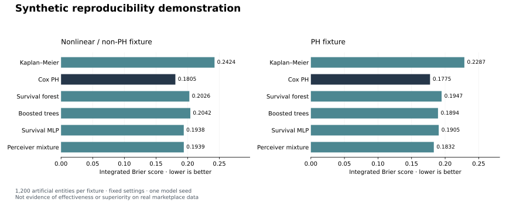

# Synthetic execution records

These are aggregate records of two completed 1,200-entity artificial-data runs.
Both use the same fixed model settings and model seed 42. Their generating seed
is 2026. The second fixture changes the data-generating mechanism to proportional
hazards; the first includes nonlinear interactions and non-proportional hazards.
The settings were not tuned after inspecting test results.



| Model | Nonlinear fixture IBS | PH fixture IBS |
|---|---:|---:|
| Kaplan-Meier | 0.242390 | 0.228664 |
| Penalized Cox PH | 0.180544 | 0.177519 |
| Random survival forest | 0.202620 | 0.194749 |
| Boosted survival trees | 0.204181 | 0.189392 |
| Discrete-time MLP | 0.193811 | 0.190466 |
| Compact Perceiver mixture | 0.193862 | 0.183155 |

Lower integrated Brier score is better. Cox PH has the lowest point estimate in
both fixtures. These are small software demonstrations with one model seed and
short training budgets, not a model-selection study or evidence about the
historical production network. Neural superiority on real data remains untested.

Each directory contains the protocol, all validation candidate records, final
test metrics, and conditional paired-bootstrap intervals. The reported source
hash corresponds to the package used for the saved run. Running the same fixture
again after correcting a software edge case reproduced every displayed value;
the checked-in records come from that verified version. No test-driven model
changes were made.

- [Nonlinear fixture](synthetic_smoke/summary.json)
- [PH fixture](synthetic_ph_smoke/summary.json)

Generate the figure from the aggregate records:

```sh
python -m pip install -e '.[plots]'
python scripts/plot_benchmark.py research/examples/synthetic_smoke/summary.json research/examples/synthetic_ph_smoke/summary.json --output results/synthetic_comparison.svg
```
